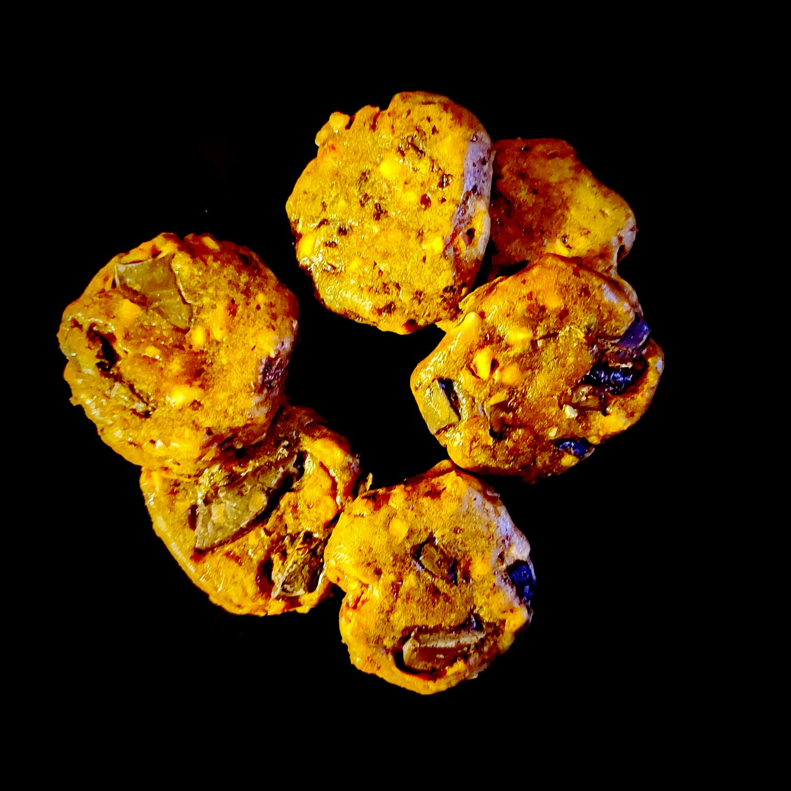

---

layout: recipe
title:  "PB Cookies"
image: PB-cookies/PB-cookies-1.jpg
tags: snack, cookie, beurre de cacahuète, chocolat, chunks, mâcher

ingredients:
- 100g de beurre de cacahuète crunchy (avec des morceaux de cacahuète)
- 40g sucre de canne complet
- 1 oeuf
- 40g farine t45 à t80
- 20–30g chocolat concassé
- Pincée sel

directions:
- Coupez le chocolat en petits morceaux non homogènes et réservez. Vous pouvez également utiliser des pépites pour l'intégralité de la recette pour gagner du temps.
- Mélangez le beurre de cacahuète avec le sucre. Si le beurre de cacahuète est trop épais vous pouvez le passer quelques secondes au micro-ondes pour le rendre plus liquide et facile à travailler. 
- Incorporez l'œuf et continuer à mélanger. Puis même chose avec la farine et le sel tamisés.
- Enfin incorporez vos morceaux de chocolat et distribuez-les au mieux dans la pâte. 
- Laissez reposer au réfrigérateur au moins 15 minutes.
- Préchauffer le four à 190°C. 
- Déposez 8 cuillères à soupe de pâte à cookies sur une plaque chemisée de papier ou d'un tapis de cuisson. 
- Étalez les cookies à l'aide de la main mouillée ou huilée pour que la pâte ne colle pas. 
- Enfournez 10 minutes ou jusqu’à ce que les bords soient légèrement dorés.

---

Un cookie sans beurre mais très fort en cacahuète. Là on est vraiment sur du cookie à mâcher, pas sur quelque chose de croquant.

Ici on utilise du beurre de cacahuète chunky (avec des cacahuètes concassées) comme raccourci, mais tu peux aussi utiliser une autre purée d’oléagineux (amande, tahin, cajou) et mixer avec des morceaux de fruits secs (amande, noisettes, cerneaux, etc.).

Évidemment la base, c’est d’amener un fort contraste avec du chocolat – si possible ton préféré –, comme pour les produits Reese’s. 

Attention, la pâte est particulièrement collante, n'hésite pas à mouiller/huiler tes mains pour la manipuler plus facilement.

Conservation&nbsp;: 4-5 jours dans une boîte hermétique à l'abri de la lumière et la chaleur.