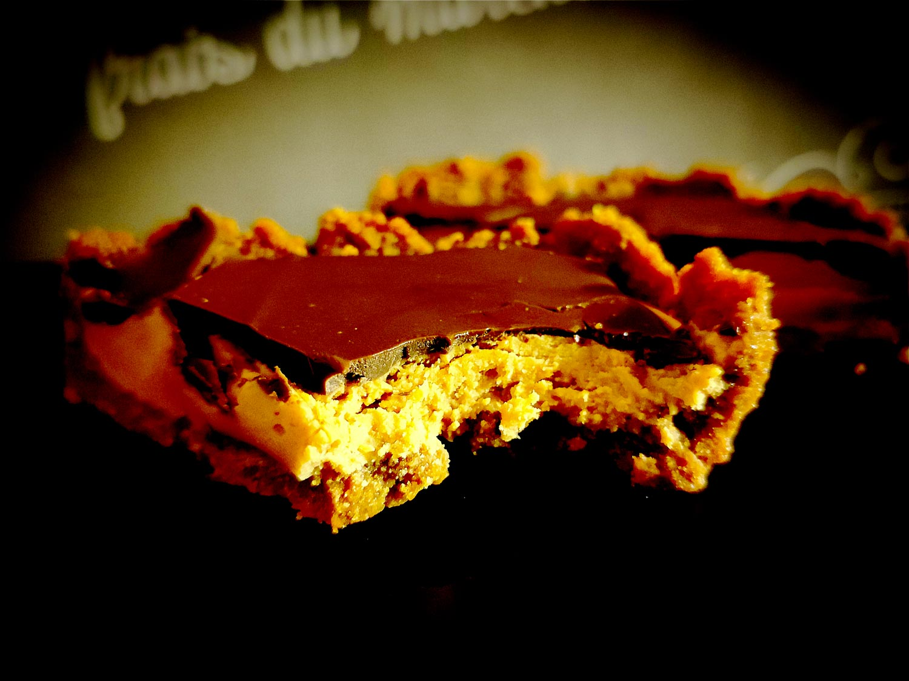

---

layout: recipe
title: "Peanut Butter Special"
image: PB-Special/pbs-1.jpg
tags: special, sans cuisson, speculoos, beurre de cacahuète, chocolat, sans four

ingredients:
- 40–50g de chocolat noir

components:
- Speculoos Crust
- Fourrage au beurre de cacahuète

directions:
- Tapissez un moule pouvant allant au réfrigérateur de papier cuisson en minimisant au maximum les plis.
- Foncez ensuite la pâte dans votre moule en prenant soin de bien tasser la base et les bords. Les bords doivent être suffisamment hauts pour accueillir le fourrage au beurre de cacahuète et la couche de chocolat – après à vous d'adapter les proportions du fourrage et chocolat aux différentes étapes du montage si vous voyez que les bords ne le sont pas assez. 
- Réservez au frais pendant au minimum 1 heure, il faut que cette base soit suffisamment solide pour accueillir le fourrage au beurre de cacahuète.
- Étalez le fourrage au beurre de cacahuète dans cette coque en Spéculoos.
- Réservez au frais pendant au minimum 30 minutes.
- Faites fondre votre chocolat au bain marie ou micro-ondes puis laissez le un peu refroidir avant de le verser sur votre beurre de cacahuète. Si le chocolat fondu est toutefois trop épais, on peut ajouter quelques gouttes d'huile.
- Lissez la surface en remuant votre moule – on évite la spatule pour ne pas trancher le chocolat. 
- Réservez au frais une dernière fois jusqu'à ce que votre chocolat soit dur. 

---

Les <i lang="en">Specials</i> sont des épiques avec peu d’ingrédients, sans cuisson, et réservés aux <i lang="en">cheat days</i> et célébrations. Ils viennent volontier couronner un objectif, progrès, ou plus généralement, tout accomplissement digne d’une tartelette XXL.

Le Peanut Butter Special peut se concevoir comme la rencontre entre un fond de cheesecake et une <i lang="en">cup</i> au beurre de cacahuète Reese’s géante.

Conservation&nbsp;: 5–7 jours dans une boîte hermétique au frigo.