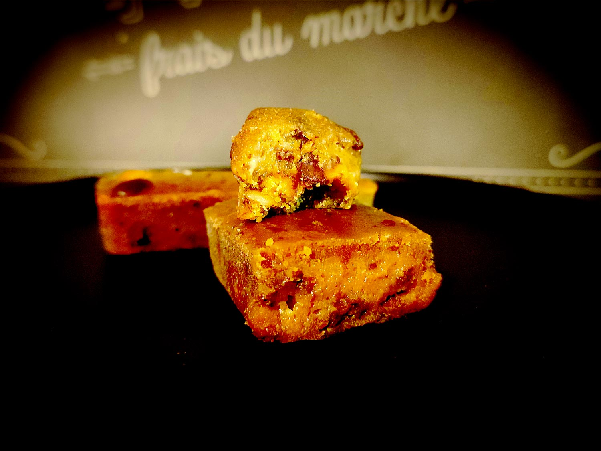

---

layout: recipe
title: "PB&B Blondies"
image: PBB-blondies/PBB-blondies-1.jpg
tags: snack, cookie, biscuit, chocolat blanc, beurre de cacahuète, noisette

ingredients:
- 1 banane mûre
- 125g de beurre de cacahuète Crunchy (avec des morceaux)
- 2 œufs
- 50g de chocolat noir à la fleur de sel
- 50g de farine T65
- 40g de sucre de canne complet

directions:
- Préchauffez le four à 180°C.
- Concassez le chocolat en petits morceaux/chunks. Réservez.
- Écrasez ou mixez la banane en purée homogène, il n’y a pas besoin qu’elle soit parfaitement lisse.
- Ajoutez les oeufs, le sucre complet, la farine, et le beurre de cacahuète en mélangeant tout juste pour les incorporer entre chaque ajout.
- Incorporez et distribuez le chocolat concassé dans la pâte. 
- Versez dans votre moule.
- Enfournez 15–20 minutes ou jusqu’à ce que les bords soient légèrement dorés.
- Laissez ensuite refroidir et servez-vous!

---

On a souvent tendance à considérer le blondie comme un brownie sans chocolat mais c'est une vision pas mal erronée de la chose. 

L’ingrédient le plus important car il diffère entre les 2 recettes, c'est le sucre brun. Mais pas le sucre brun à la française, qui est souvent un sucre coloré/aromatisé au caramel, mais plutôt le sucre brun américain, qui se rapproche d'un sucre de canne complet (et du muscovado, du rapadura, ou du demerara).

C'est un sucre qui n'est pas totalement raffiné, qui est par conséquent plus humide que le sucre blanc/roux car il contient encore de la mélasse, et qui apporte selon sa provenance un arôme de caramel, de réglisse, de vanille, de rhum, etc. dans vos recettes. Dans la version traditionnelle, on n'hésitera pas non plus à utiliser un beurre noisette pour un blondie encore plus généreux en goût.

Vous pouvez d'ailleurs remplacer une partie du beurre de cacahuète et de la banane/compote par du beurre noisette – mais je n'ai pas testé donc je ne pourrais pas dire dans quelles proportions. 

Conservation&nbsp;: 3-5 jours à température ambiante dans une boîte hermétique à l'abri de la lumière et de la chaleur. Ou congélateur pour 2–3 mois.