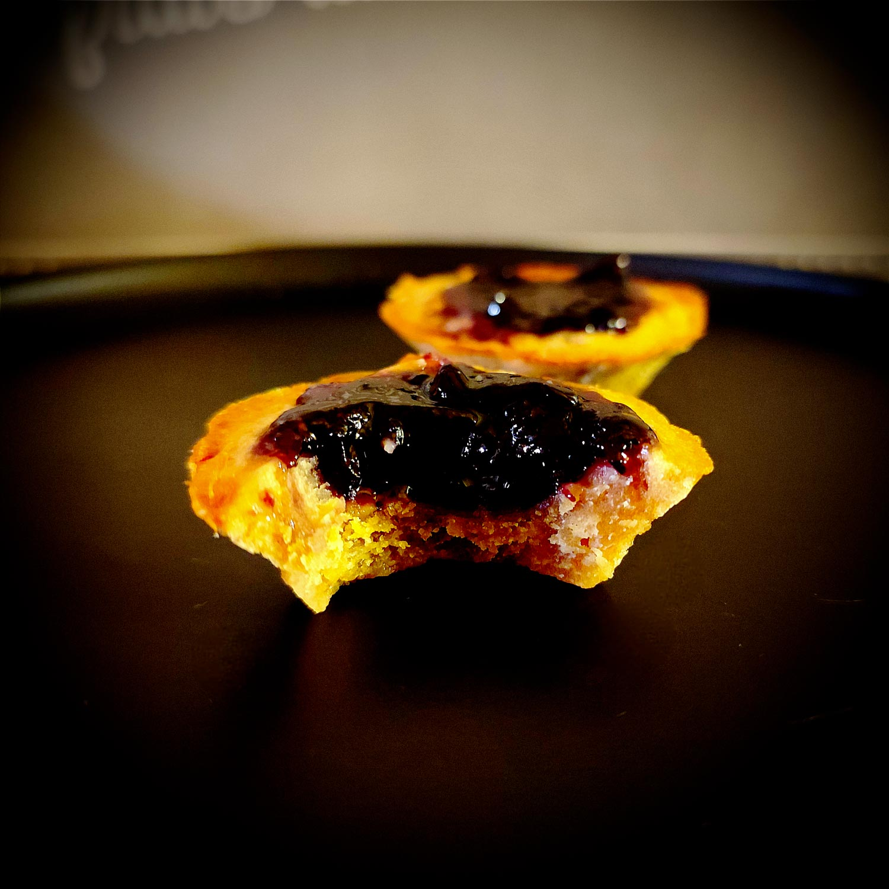

---

layout: recipe
title:  "Peanut Butter & Jelly Cups"
image: pbj-cups/pbj-cups-1.jpg
tags: snack, tartelettes, beurre de cacahuète, confiture, gelée, myrtilles, cups

ingredients:
- 125g de beurre de cacahuète smooth
- 40g de sucre de canne complet ou cassonnade
- 40g de sucre blanc
- 2 oeufs
- 80g de farine
- 180g de confiture/gelée de fruit(s) au choix
- pincée de sel

directions:
- Mélangez le beurre de cacahuète avec le sucre. Si le beurre de cacahuète est trop épais vous pouvez le passer quelques secondes au micro-ondes pour le rendre plus liquide et facile à travailler. 
- Incorporez l'œuf et continuer à mélanger. Puis même chose avec la farine et le sel tamisés.
- Laissez reposer au réfrigérateur au moins 15 minutes.
- Préchauffer le four à 180°C. 
- Dans un moule à mini tartelettes/muffins/cupcakes, façonnez la base avec la pâte en vous assurant que les bords soient suffisamment épais et en laissant un creux au milieu. Le mieux est de foncer la pâte en mouillant/huilant vos doigts pour qu'elle ne colle pas trop.
- Déposez une cuillère à café de confiture dans le creux en essayant de ne pas trop dépasser de la surface.
- Enfournez 12–20 minutes ou jusqu’à ce que les bords soient bien forés (ça va aussi dépendre du type de moule et de la profondeur de la cup du coup). Notez que la confiture risque de se liquéfier et déborder en fin de cuisson, ce n'est pas hyper esthétique mais c'est normal.
- Laissez refroidir avant de démouler. À la sortie du four vos cups ne seront pas encore très solides structurellement, il faut attendre un peu avant de les démouler et les manipuler avec douceur, elles vont complètement durcir, y compris la confiture, en refroidissant sur une grille.

---

La combinaison mythique venue de Nord-Amérique&nbsp;: PB&J (Peanut Butter & Jelly, ou du beurre de cacahuète avec de la confiture). En général, cette combinaison se déguste en sandwich, mais ici on fait l’impasse sur le pain de mie. Le résultat, c’est une petite tartelette bien gourmande mais qui reste pas mal équilibrée.

Une petite astuce à noter. On utilise 2 types de sucre car ils apportent la texture typique du cookie à l'américaine&nbsp;: le sucre blanc apporte le croquant de l'enveloppe, le sucre complet/brun, plus humide car il est moins raffiné et contient par conséquent encore de la mélasse, le moelleux à l’intérieur.

Vous pouvez également faire l’impasse sur la confiture et la remplacer par… De la banane en purée ou en morceaux, du caramel, de la pâte à tartiner chocolat noisette ou du fluff – pâte de marshmallow. Ces associations fonctionnent également très bien. 

Conservation&nbsp;: 3 jours dans une boîte hermétique au frigo.