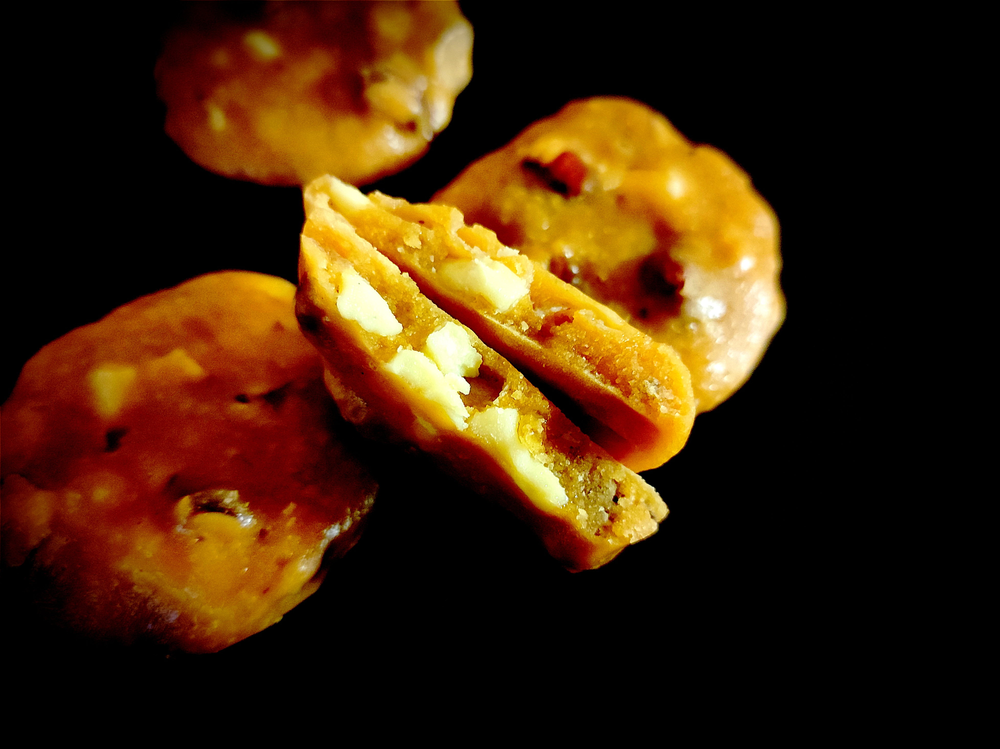

---

layout: recipe
title: "PB Cookies chocolat blanc noisettes"
image: pbwc-cookie/pbwc1.jpg
tags: snack, cookie, biscuit, chocolat blanc, beurre de cacahuète, noisette

ingredients:
- 45g beurre de cacahuète smooth
- 20g chocolat blanc fondu
- 25g cassonade
- 15g sucre blanc
- 1 oeuf
- 50g farine
- 20g pépites de chocolat blanc
- 20g noisettes concassées

directions:
- Mélangez le beurre de cacahuète, le chocolat fondu, et les sucres jusqu'à l'obtention d'une pâte parfaitement lisse.
- Ajoutez l'œuf et continuez à mélanger. 
- Incorporez la farine, puis les pépites de chocolat blanc et noisettes concassées. 
- Laissez reposer au frais au moins 15 minutes. 
- Préchauffez le four à 190°C. 
- Déposez 8 cuillères à soupe de pâte à cookies sur une plaque chemisée de papier ou d'un tapis de cuisson. 
- Étalez les cookies à l'aide de la main mouillée ou huilée pour que la pâte ne colle pas. 
- Enfournez 10 minutes ou jusqu’à ce que les bords soient légèrement dorés.

---

Des cookies à mâcher, et pas à croquer.

Conservation 4-5 jours dans une boîte hermétique à l'abri de la lumière et la chaleur.