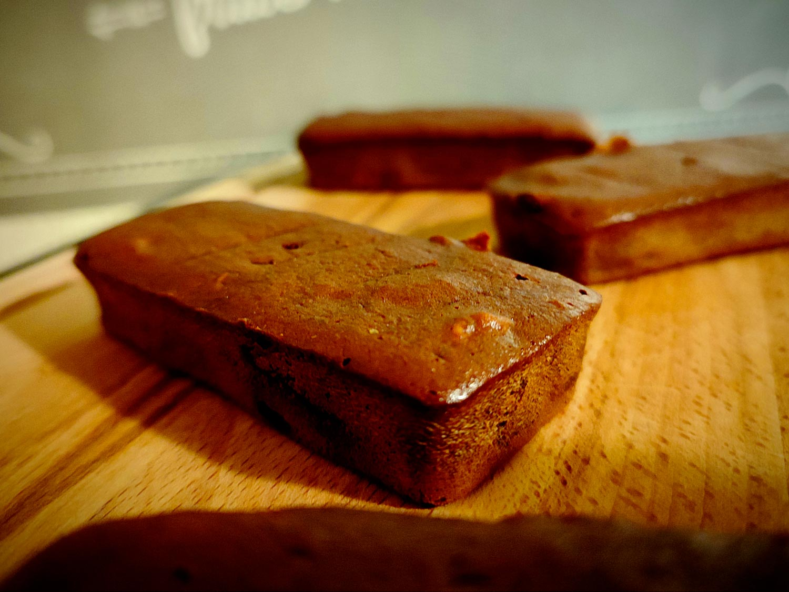

---

layout: recipe
title:  "Brownie de triche à la banane"
image: banana-brownie/banana-brownie-1.jpg
tags: banane, muffin, cake, chocolat, moelleux, snack

ingredients:
- 2 bananes mûres
- 80g de chocolat
- 30g de farine

directions:
- Préchauffez le four à 180°C.
- Coupez 20g de chocolat en fines lamelles et réservez.
- Dans un bol, écrasez vos bananes en purée à l'aide d'une fourchette ou d'un presse-purée. Elle n'a pas besoin d'être parfaitement lisse, juste suffisamment humide pour évoquer la consistance d'un œuf. Vous pouvez également les passer au mixer si vous ne voulez pas qu'il reste des morceaux.
- Intégrez la farine tamisée jusqu'à ce qu'il ne subsiste plus de grumeau.
- Faites fondre 60g du chocolat au micro-ondes/bain marie sans le brûler puis versez-le dans le bol. Mélangez. 
- Enfin, incorporez délicatement le chocolat que vous avez préalablement coupé et mélangez une dernière fois pour bien le distribuer. 
- Enfournez pour 15-20 minutes ou jusqu’à ce que le brownie soit pris.
- Laissez refroidir quelques minutes puis démoulez sur une grille. 

---

Un brownie ultra fondant en 3 ingrédients, c’est une recette utile à avoir sous la main pour se préparer un snack à la dernière minute.

Encore une fois, c’est la banane mûre écrasée en purée qui va venir faire le plus gros du travail. Même si on utilise quelques astuces comme l’utilisation de morceaux de chocolat dans la pâte pour en relever l’intensité et amener une texture en plus pour rendre la mâche intéressante.

Dans la même optique, on peut aller sélectionner un chocolat avec des inserts (noisettes, amandes, raisins secs, etc.), qui ajoutera une dimension en plus. Il faudra simplement en mettre un peu plus pour obtenir les 80&nbsp;grammes de chocolat. N’hésitez pas à vous faire plaisir.

 

Conservation&nbsp;: 2–3 jours dans une boîte hermétique à l’abri de la lumière et de la chaleur. 5 jours au frigo. 2 mois au congélateur.