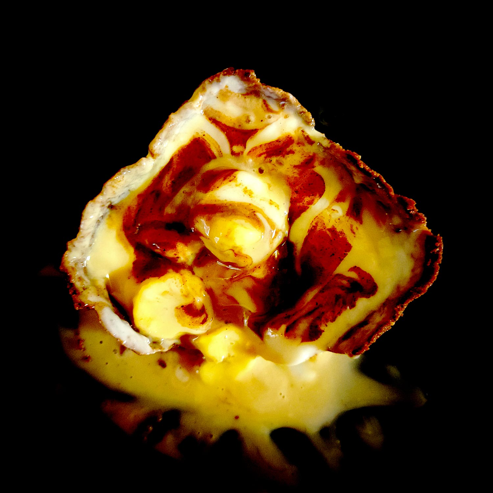

---

layout: recipe
title: "Banoffee Special"
image: Banoffee-Special/banoffee-1.jpg
tags: special, sans cuisson, cacao, banane, dulce de leche, sans four

ingredients:
- 150g confiture de lait/dulce de leche
- 2 bananes mûres coupées en tranches
- 100g de yaourt grec
- 20g de sucre glace ou 15g de miel

components:
- Cocoa Crust
- Glaçage au yaourt grec
- Glaçage cacao

directions:
- Tapissez un moule pouvant allant au réfrigérateur de papier cuisson en minimisant au maximum les plis.
- Foncez ensuite la pâte dans votre moule en prenant soin de bien tasser la base et les bords. Les bords doivent être suffisamment hauts pour accueillir le fourrage et le glaçage.
- Réservez au frigo pour au moins 30 minutes, ou jusqu'à ce que la pâte soit solide au toucher.
- Découpez la banane en tranches et tapissez le fond de tarte en prenant bien soin de napper chaque couche de confiture de lait pour combler les espaces. Pour encore plus de gourmandise vous pouvez caraméliser les tranches de banane à la poêle. 
- Réservez une nouvelle fois au réfrigérateur pour 30 minutes à 1 heure, où jusqu'à ce que la confiture de lait ait suffisamment épaissi.
- Le glaçage au yaourt grec vient remplacer la crème fouettée que l'on retrouve en général dans la recette des Banoffee Pies. Ça évite la prise de tête de la montée en chantilly, d'autant plus avec une si petite quantité. 
- Versez le glaçage au yaourt grec sur la confiture de lait.
- Puis versez grossièrement le glaçage cacao sur le yaourt grec en ne cherchant pas à le recouvrir en entier puis, à l'aide d'une pointe, tracez des traits en travers de cette couche pour créer une décoration. 
- Réservez pour la nuit au frigo.

---

Les <i lang="en">Specials</i> sont des épiques avec peu d’ingrédients, sans cuisson, et réservés aux <i lang="en">cheat days</i> et célébrations. Ils viennent volontier couronner un objectif, progrès, ou plus généralement, tout accomplissement digne d’une tartelette XXL.

Le Banoffee Special est la rencontre entre la banane et le goût caramel sous toutes ses formes. Pour une garniture hyper coulante, on utilise ici de la confiture de lait (<i lang="es">dulce de leche</i>).

Le double glaçage est une idée de décoration, vous pouvez également zapper cette étape et faire un rappel avec quelques tranches de bananes et une cuillerée/traînée de confiture de lait juste avant de servir, ou ajouter du croquant avec quelques miettes des mêmes biscuits que ceux utilisées pour la pâte, partir sur un caramel, etc. À vous de jouer.  

Conservation&nbsp;: 5–7 jours dans une boîte hermétique au frigo.