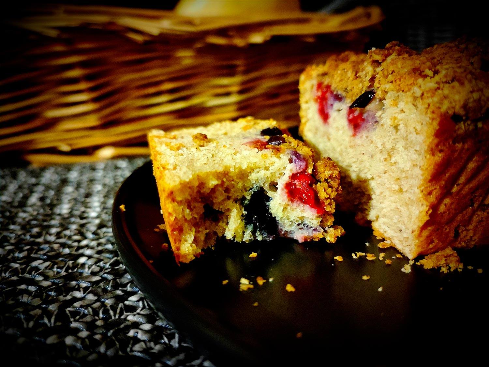

---

layout: recipe
title: "Berry Crumble"
image: berry-crumble/berry-crumble-1.jpg
tags: snack, cake, crumble, framboise, myrtille, cannelle, yaourt grec, crème épaisse

ingredients:
- 150g de farine semi-complète T110
- 125g de myrtilles
- 125g de framboises
- 50g de sucre
- 60g de beurre mou
- 150g de yaourt grec ou de crème epaisse
- 1 œuf
- extrait de vanille
- 1/2 cuillère à café de cannelle
- 1 cuillère à café de levure chimique
- pincée de sel

components:
- Crumble de canne

directions:
- Préchauffez le four à 180°C.
- Dans un bol, crémez le beurre avec le sucre. 
- Dans un autre bol, tamisez la farine, la cannelle, le sel, et la levure. Mélangez.
- Ajoutez-en la moitié à la crème de beurre en continuant à battre. 
- Ajoutez la moitié de yaourt grec/crème épaisse en continuant à battre. 
- Rebelote avec les autres moitiés en continuant à battre jusqu’à l’obtention d'une pâte bien lisse. Attention, on ne veut pas trop la travailler – on risque en effet d’obtenir une pâte trop dense après cuisson –, il faut la travailler juste ce qu'il faut pour que ces ingrédients soient incorporés. 
- Versez la préparation dans un moule graissé.
- Nettoyez et essuyez myrtilles et framboises puis répartissez-les sur la pâte en laissant une marge aux bords. Pour éviter qu’elles ne tombent au fond lors de la cuisson, vous pouvez les fariner avant de les répartir. 
- Enfin sortez la pâte à crumble et répartissez-la sur les fruits rouges. Tassez-le très légèrement pour qu'il se tienne mieux une fois cuit en prenant soin de ne pas écraser les fruits rouges.
- Enfournez pendant 35–45 minutes ou jusqu'à ce qu'un cure-dent ressorte quasiment sec, avec quelques flocons de mie.
- Laissez refroidir à la sortie du four avant de démouler. Dans l'idéal il faut que votre moule soit à température ambiante. Le cake va continuer à cuire donc soyez très prudent lors du démoulage, il sera encore un peu mou et va durcir en refroidissant, en particulier le crumble.

---

Le <i lang="en">Berry crumble</i> est un <i lang="en">coffee cake</i> typique de celui que tu te tapes avec ton café Starbucks, mais en version fruits rouge. C‘est moelleux, on sent bien la cannelle, ça se laisserait presque tremper dans ta pinte de sucre caféinée mais il n’y en a pas du tout besoin tellement c’est humide de base.

Le risque avec cette recette finalement, c’est de voir disparaître le cake en un seul goûter.

Conservation&nbsp;: 2–3 jours à température ambiante à l'abri de la lumière et de la chaleur dans une boîte hermétique. 5 jours au frigo.