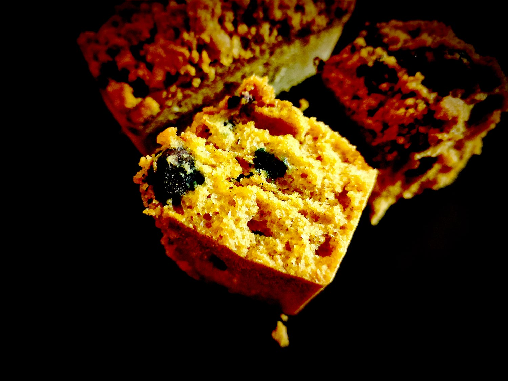

---

layout: recipe
title: "Biscoffee Cakes"
image: biscoffee/biscoffee-1.jpg
tags: snack, cakes, crumble, Speculoos, Biscoff, myrtille, cannelle

ingredients:
- 150g de farine semi-complète T110
- 125g de myrtilles
- 100g de pâte à tartiner Spéculoos
- 150g de fromage blanc/yaourt grec
- 2 œufs
- extrait vanille
- 1 cuillère à café de levure chimique
- 1 pincée de sel

components:
- Crumble de canne

directions:
- Préchauffez le four à 180°C.
- Dans un bol, battez la pâte à tartiner avec les œufs et la vanille en fouettant bien pour obtenir une sorte de crème. La pâte remplace en quelque sorte le mélange de beurre et de sucre, on cherche donc à obtenir une consistance similaire. Vous pouvez éventuellement ajouter un peu d'huile ou de beurre si besoin. Vous pouvez également chauffer la pâte au micro-ondes pour la rendre plus liquide si celle-ci se révèle trop compliquée à manipuler. 
- Dans un autre bol, tamisez la farine, le sel, et la levure. Mélangez.
- Ajoutez-en la moitié à la crème en continuant à battre puis ajoutez la moitié de fromage blanc. 
- Rebelote avec les autres moitiés en continuant à battre jusqu'à l'obtention d'une pâte bien lisse. Attention, on ne veut pas trop la travailler – on risque en effet d'obtenir une pâte trop dense après cuisson –, il faut la travailler juste ce qu'il faut pour que ces ingrédients soient incorporés. 
- Versez la préparation dans un moule aux empreintes graissées.
- Nettoyez et essuyez les myrtilles puis répartissez-les sur la pâte en appuyant légèrement dessus pour bien les ancrer tout en laissant une marge de 1cm de chaque côté. Pour éviter qu’elles ne tombent au fond, vous pouvez les fariner avant de les répartir. 
- Sortez la pâte à crumble et répartissez-la par dessus. Tassez-le très légèrement pour qu'il se tienne mieux une fois cuit en prenant soin de ne pas écraser les myrtilles.
- Enfournez pendant 35–45 minutes ou jusqu'à ce qu'un cure-dent ressorte quasiment sec, avec quelques flocons de mie.
- Laissez refroidir à la sortie du four avant de démouler. Dans l'idéal il faut que votre moule soit à température ambiante. Les cakes vont continuer à cuire donc soyez très prudent lors du démoulage, ils seront encore un peu mou et vont durcir en refroidissant, en particulier le crumble.

---

Le secret de ces mini cakes, c'est que l'on va prendre un gros raccourci avec la pâte à tartiner Biscoff/Spéculoos qu'on peut aisément trouver dans le commerce. En plus de donner le goût typique du Spéculoos à la base de notre coffee cake, Elle va remplacer le beurre et le sucre et nous économiser la préparation de la “crème pommade”, un peu comme le beurre de cacahuète dans mes PB cookies et PB&B Blondies.

Plus besoin de choisir entre le biscuit Spéculoos et le coffee cake à l'heure du thé, vous pouvez avoir les 2&nbsp;!

Si vous voulez vraiment vraiment enfoncer le clou, vous pouvez faire votre crumble avec une farine de biscuits Spéculoos mixés/émiettés.

Et si vous souhaitez remplacer la myrtille dans la recette, vous pouvez chercher du côté des ingrédients qui s'associent bien à la cannelle, et pas uniquement axer votre recherche spécifiquement sur le Spéculoos – qui vous mènera probablement sur la framboise et la fraise.

Conservation&nbsp;: 2–3 jours à température ambiante à l'abri de la lumière et de la chaleur dans une boîte hermétique.