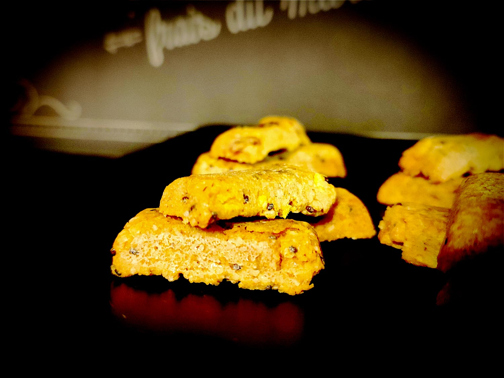

---

layout: recipe
title: "Biscuits à l’avoine"
image: biscuit-avoine/biscuit-avoine-1.jpg
tags: snack, biscuit, raisins secs, graines de chia, riz soufflé, corn flakes, healthy, santé

ingredients:
- 1 cuillère à soupe de graines de chia
- 40–50g de raisins secs
- 40g de corn flakes en morceaux ou de riz soufflé

components:
- Pâte sablée à l’avoine

directions:
- Avant d’étaler la pâte et de la filmer pour la mettre au frigo, ajoutez les graines de chia, raisins secs et corn flakes/riz soufflé puis mélangez pour bien les distribuer.
- Laissez reposer 30 minutes au frigo.
- Préchauffez le four à 180°C.
- Abaissez la pâte pour obtenir une épaisseur de 4–5mm puis découpez des biscuits à l’aide d’un emporte pièce.
- Déposez les biscuits sur une plaque de cuisson. 
- Enfournez pour 15-20 minutes ou jusqu'à ce que les bords soient légèrement dorés.
- Disposez les biscuits sur une grille et laissez les refroidir.

---

Ça ressemble un peu aux biscuits santé/<i lang="en">healthy</i> que tu peux croiser dans les rayons et magasins bio, ce n’est pas forcément faux mais au moins c’est toi qui les aura fait, et tu pourras les personnaliser.

Pour plus de croquant je conseille le riz soufflé, même si c’est plus compliqué à trouver sans une quantité ahurissante de sucre, au contraire des <i lang="en">corn flakes</i> qui eux, seront trouvables quasi pour sûr en vrac sans sucre ajouté par dessus.

Conservation&nbsp;: 1 semaine dans une boîte à biscuits à l'abri de la chaleur et de la lumière. 