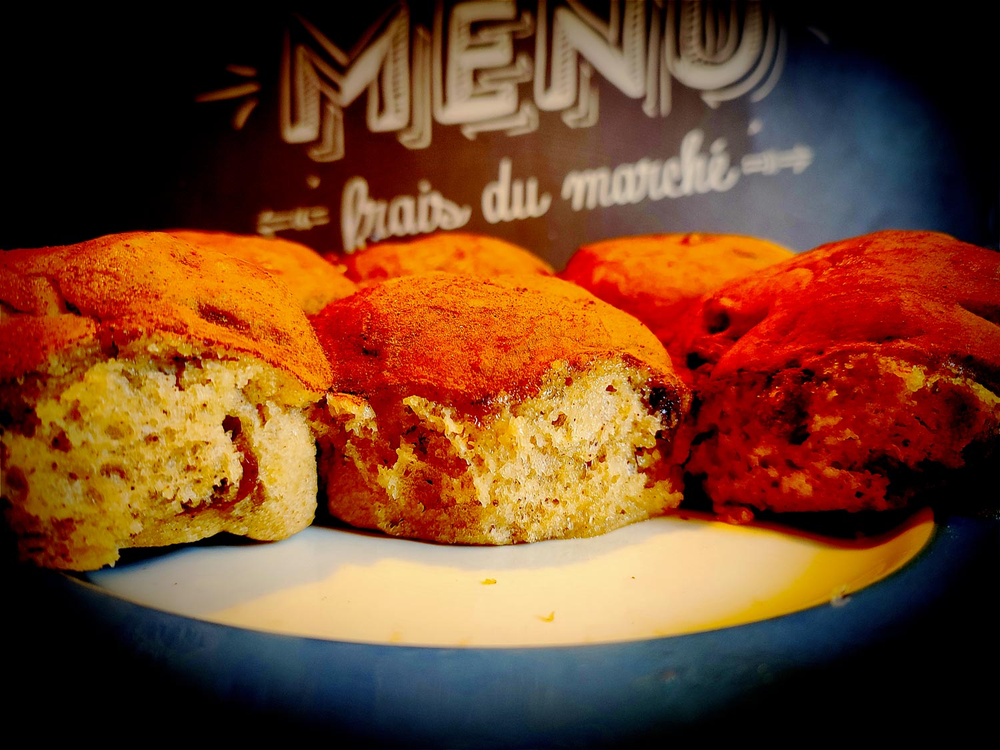

---

layout: recipe
title: "Brioche Butchy"
image: butchy-brioche/butchy-brioche-1.jpg
tags: snack, cannelle, brioche, raisins secs, fleur d’oranger, 4 épices

ingredients:
- 250g de farine T45–T55
- 1 sachet de levure boulangère sèche
- 100g de crème fraîche épaisse
- 1 oeuf
- 50g de lait tiède
- 30g de sucre
- 1/2 cuillère à café de sel
- 100g de raisins secs
- 1 cuillère à café de mélange 4 épices
- extrait de fleur d’oranger
- 50g de jus orange
- 50g de sucre glace
- 1 cuillère à café de cannelle

directions:
- Laissez macérer les raisins secs 10 minutes dans de l’eau chaude, du jus d’orange, ou du rhum, pour qu'ils puissent gonfler.
- Si besoin, réhydratez votre levure dans le lait tiède et le sucre.
- Dans un grand bol, mélangez la farine, le sel, et le mélange 4 épices.
- Ajoutez la levure, le lait tiède, le sucre, l’extrait de fleur d’oranger, et la crème fraîche. 
- Bien pétrir jusqu'à ce que la pâte soit bien lisse et ne colle quasiment plus aux doigts – au robot, quand la pâte se décolle des parois, pas plus. Elle doit néanmoins rester bien souple, donc ajustez farine et liquide en conséquence. 
- Laissez lever le mélange recouvert d’un torchon dans un endroit chaud pendant 1h30–2h. Elle devrait avoir doublé de volume au bout de ce laps de temps. Vous pouvez également la préparer la veille et la laisser lever au frigo pendant la nuit.
- Préchauffez le four à 160°C.
- Sur un plan de travail fariné, abaissez la pâte en un rectangle de 35 cm sur 25 environ.
- Saupoudrez-la de la moitié des raisins secs réhydratés puis repliez-la sur elle même.
- Abaissez la pâte à nouveau et répétez l’opération avec la seconde moitié de raisins secs.
- Abaissez une dernière fois et formez un boudin.
- Découpez 8 parts de poids identiques et formez des boules bien rondes. 
- Placez-les côte à côte dans un moule beurré et fariné en laissant un peu d’espace. 
- Laissez lever 45 minutes à 1 h jusqu’à ce que ces espaces soient comblés.
- Enfournez 25 à 30 min où jusqu’à ce que le dessus des boules soient bien dorés.
- Laissez refroidir la brioche sur une grille avant de la glacer.
- Préparez le glaçage à l’orange. Mélangez 50g de jus d’orange avec 50g de sucre glace. Vous pouvez ajouter du sucre glace si le résultat vous semble trop liquide ou, au contraire, du jus d’orange s’il ne l’est pas assez.
- Déversez-le sur le dessus de la brioche pour bien l’imbiber.
- Enfin, saupoudrez la cannelle par dessus – vous pouvez vous servir d’un pinceau pour homogénéiser la couverture si jamais vous vous ratez.

---

Une brioche pour l’hiver, avec des saveurs qui rappellent le pain d’épice. La particularité nous vient d’Allemagne puisque cette brioche utilise de la crème fraîche épaisse.

Conservation&nbsp;: 2–3 jours dans une boîte à l’abri de la lumière et de la chaleur à température ambiante.