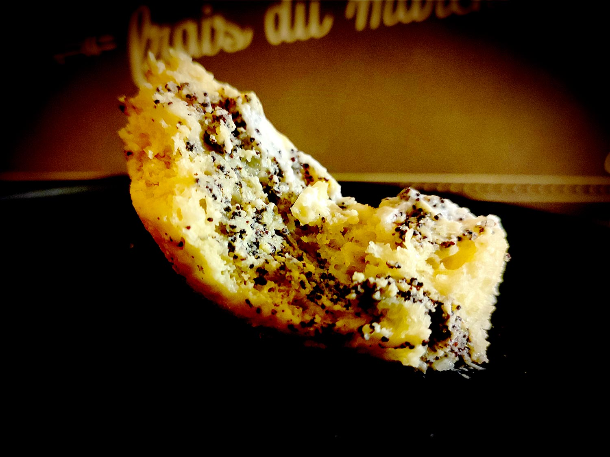

---

layout: recipe
title: "Butchy’s Poppy Rolls"
image: poppy-rolls/poppy-rolls-1.jpg
tags: snack, brioche, pavot, roll, roulé, glaçage, yaourt grec

components: 
- Brioche Butchy pour Rolls
- Crème de pavot
- Glaçage au yaourt grec

directions:
- Préchauffez le four à 160°C.
- Sur un plan de travail fariné, abaissez la pâte en un rectangle de 35 cm sur 25 environ.
- Tapissez-la de la crème de pavot en prenant bien soin d’égaliser à la spatule, et de laisser un espace des 4 côtés.
- Roulez la pâte en un boudin.
- Découpez 8 petits roulés de taille et poids environ identiques. 
- Placez-les côte à côte dans un moule beurré et fariné en laissant un peu d’espace. 
- Laissez lever 45 minutes à 1 h jusqu’à ce que ces espaces soient comblés.
- Enfournez 25 à 30 min où jusqu’à ce que le dessus des boules soient bien dorés.
- Laissez refroidir la brioche sur une grille avant de la glacer.
- Préparez le glaçage au yaourt grec.
- Déversez-le sur le dessus de la brioche en prenant soin de bien le couvrir à l’aide d’une spatule.
- Laissez prendre le glaçage 1 à 2h au réfrigérateur.

---

Des petits roulés briochés à la crème de pavot. Moelleux, riches et bien humides.

Conservation&nbsp;: 2–3 jours dans une boîte à l’abri de la lumière et de la chaleur à température ambiante.