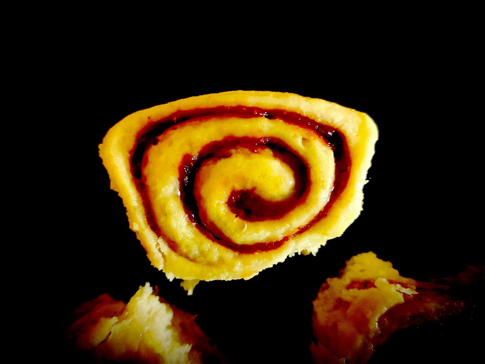

---

layout: recipe
title: "Butchy’s Strawberry Rolls"
image: butchy-strawberry/butchy-strawberry-1.jpg
tags: snack, brioche, fraise, roll, roulé, glaçage citron

components: 
- Brioche Butchy pour Rolls
- Garniture à la fraise
- Glaçage au citron

directions:
- Préchauffez le four à 160°C.
- Sur un plan de travail fariné, abaissez la pâte en un rectangle de 35 cm sur 25 environ.
- Tapissez-la de la garniture de fraise en prenant bien soin d’égaliser à la spatule, et de laisser un espace des 4 côtés.
- Roulez la pâte en un boudin.
- Découpez 8 petits roulés de taille et poids environ identiques. 
- Placez-les côte à côte dans un moule beurré et fariné en laissant un peu d’espace. 
- Laissez lever 45 minutes à 1 h jusqu’à ce que ces espaces soient comblés.
- Enfournez 25 à 30 min où jusqu’à ce que le dessus des boules soient bien dorés.
- Laissez refroidir la brioche sur une grille avant de la glacer.
- Préparez le glaçage au citron.
- Déversez-le sur le dessus de la brioche pour bien l’imbiber.
- Laissez prendre le glaçage à température ambiante.

---

Des petits roulés briochés à la fraise et glacés au citron. Moelleux et rafraichissants pour l’été.

Conservation&nbsp;: 2–3 jours dans une boîte à l’abri de la lumière et de la chaleur à température ambiante.