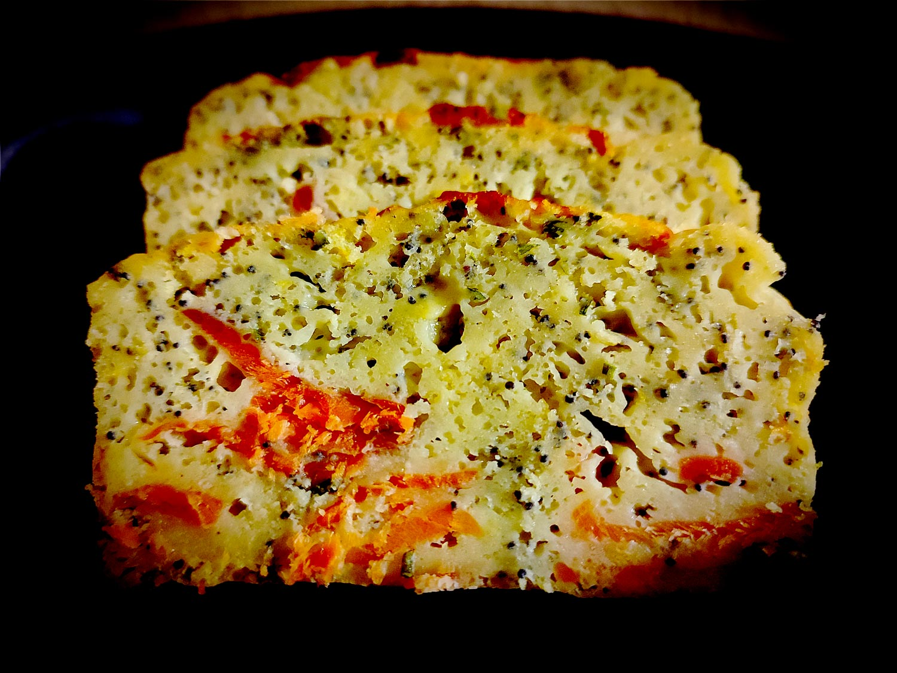

---

layout: recipe
title: "Cake citron pavot truite"
image: cake-truite/cake-truite-1.jpg
tags: cake, salé, apéro, plat, citron, pavot, saumon, truite, lait fermenté

components: 
- Lait fermenté

ingredients:
- 150g de farine
- 3 oeufs
- 150g de truite ou saumon fumée
- 15cl de lait fermenté
- ciboulette
- 1/2 cuillère à café de jus de citron
- zestes d’1 citron
- 1/2 cuillère à café de levure chimique
- 1/2 cuillère à café de bicarbonate
- mini pincée de sel
- poivre
- 1 cuillère à soupe de graines de pavot

directions:
- Préchauffez le four à 180°C.
- Découpez la truite/saumon fumée en petits dés/lamelles. Réservez.
- Fouettez les œufs puis ajoutez le jus de citron, le sel, le poivre, la ciboulette. Mélangez. 
- Ajoutez la farine, le bicarbonate et levure tamisées. Mélangez
- Ajoutez le lait fermenté. Mélangez jusqu’à obtenir une pâte bien lisse.
- Ajoutez les morceaux de truite/saumon fumé et graines de pavot. Mélangez pour bien les distribuer.
- Versez dans un moule à cake graissé.
- Enfournez pour 45–55 minutes où jusqu’à ce qu’un cure-dent ressorte sec.
- Dégustez tiède ou froid.

---

Un cake citron pavot avec un <i lang="en">twist</i> puisque ce n‘est pas un cake sucré que nous avons ici, mais bel et bien un cake salé. L’association naturelle, c’est le saumon ou la truite fumée. Mais rien ne vous empêche d’essayer une autre combinaison.

 

Conservation&nbsp;: 2–3 jours au réfrigérateur.