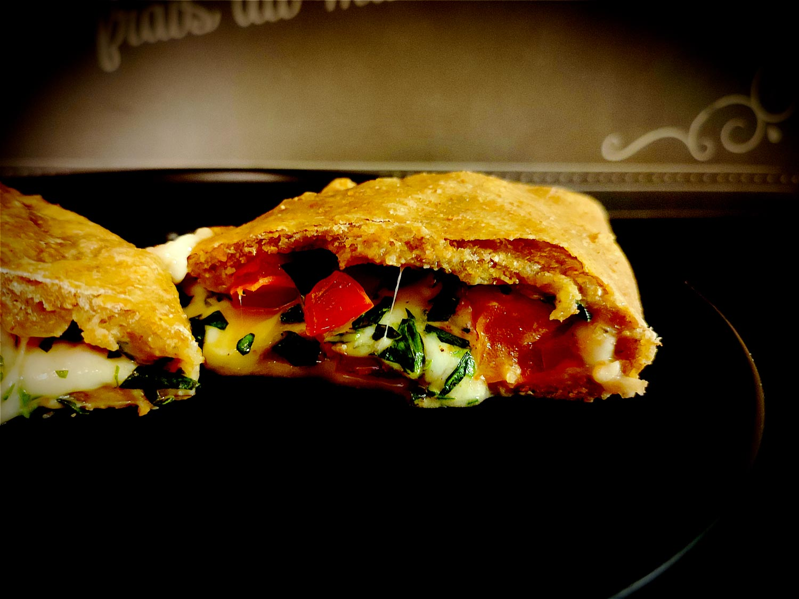

---

layout: recipe
title: "Calzone caprese"
image: calzone-caprese/calzone-caprese-1.jpg
tags: calzone, salé, pâte brisée, pâte à pizza, tomate, mozza, sans viande, basilic

components:
- Pâte brisée au fromage blanc

ingredients:
- 1 pâte brisée ou 1 pâte à pizza
- 125g de mozzarella
- 2 tomates
- 1 bouquet de feuilles de basilic
- huile d’olive
- sel
- poivre
- eau
- pignons de pin (facultatif)
- lait et jaune d’œuf pour dorure (facultatif)

directions:
- Préchauffez le four à 180°C – ou à la température indiquée sur le paquet de pâte brisée.
- Lavez, essuyez puis hachez vos feuilles de basilic.
- Égouttez et découpez la mozzarella et les tomates en petits dés. Mélangez.
- Ajoutez le basilic haché et les pignons. Mélangez.
- Arrosez d’un filet d’huile d’olive. Salez et poivrez. Mélangez pour bien imprégner tous les petits dés.
- Déroulez votre pâte et disposez la farce sur une moitié en laissant une belle marge au bord.
- Humidifiez le rebod puis repliez l’autre moitié de la pâte et scellez votre chausson. Insistez bien sur la soudure pour que le chausson ne s’ouvre pas lors de la cuisson.
- À l’aide d’un pinceau, disposez le mélange de jaune d’œuf et de lait sur le dessus des chaussons.
- Enfournez pour 20–25 minutes ou jusqu’à ce que le dessus soit bien doré.

---

La calzone, c’est un chausson généralement réalisé avec une pâte à pizza. Mais ça fonctionne aussi avec une pâte brisée. Dedans, on joue le classique tomate, mozzarella et basilic, la valeur sûre de l’Italie.

Encore une fois, choisissez les meilleurs ingrédients que vous pouvez vous permettre d’acheter. La composition est simple mais du basilic bien frais, ça change absolument tout.

 

Conservation&nbsp;: 2–3 jours au réfrigérateur.