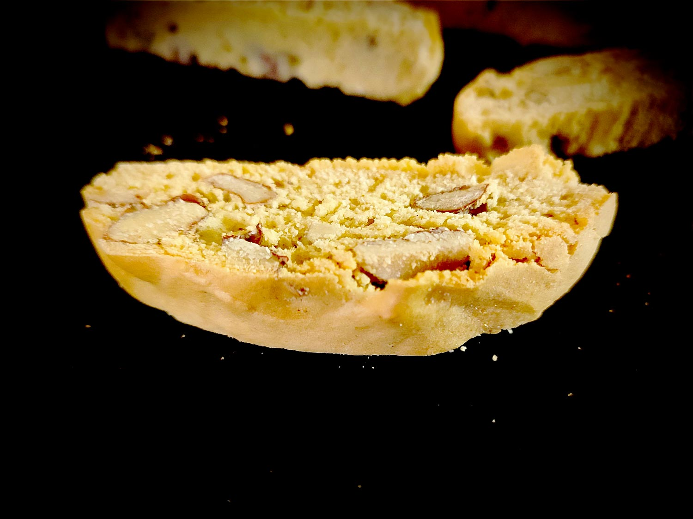

---

layout: recipe
title: "Cantucci aux amandes"
image: cantucci/cantucci-1.jpg
tags: biscuit, Italie, amande, snack, craquant, sucre, canistrelli corse, fleur d’oranger

ingredients:
- 215g de farine italienne 00/française T45
- 100g de sucre blanc
- 100g d’amandes décortiquées
- 2 œufs
- 1 cuillère à café de levure chimique
- extrait de fleur d’oranger
- pincée de sel

directions:
- Préchauffez le four à 180°C.
- Dans un bol, tamisez la farine et ajoutez-y le sucre, le sel et la levure. Mélangez puis formez un puit.
- Cassez les œufs dans un autre bol et battez-les en omelette, puis ajoutez la fleur d’oranger et mélangez.
- Ajoutez les œufs au bol des ingrédients secs. 
- Vous allez devoir vous dépatouiller avec un mélange très collant, c'est normal. Courage, vous pouvez y arriver sans en mettre partout.
- Ajoutez les amandes par poignées pour bien les distribuer.
- Réalisez deux gros boudins un peu moins longs que votre plaque de cuisson, en les espaçant car la pâte va s'étaler à la cuisson – voire même avant. La pâte est très collante, n'hésitez pas à humidifier vos mains pour qu'elle soit plus facile à manipuler. N’ajoutez par contre surtout pas de farine au risque de rendre vos biscuits casse-dents. 
- Enfournez pour 25–30 minutes. Il vous faut obtenir deux boudins fermes et légèrement dorés, faciles à découper en tranches.
- Sortez votre plaque du four et laissez refroidir vos boudins pendant 10 minutes. 
- Découpez-les ensuite en tranches d’1–1.5cm de largeur avec un couteau à pain – ou à défaut un couteau scie en faisant très attention à ne pas les casser lors de la découpe.
- Disposez les tranches sur la plaque de vuisson en prenant soin de les espacer un peu.
- Ré-enfournez 10–15 minutes en surveillant la cuisson. Les biscuits ne doivent pas être durs à la sortie du four, ils vont en effet durcir en refroidissant sur une grille.

---

Le <i lang="it">cantucci</i>, c’est le vrai biscuit à l’ancienne, le biscuit qui est cuit 2 fois. Il doit être bien sec et ultra croquant, et est donc parfait pour accompagner le thé ou le café.

Si vous savez faire un <i lang="it">cantucci</i>, vous saurez quasiment faire un canistrelli corse. D’une pierre deux coups&nbsp;!

 

Conservation&nbsp;: 5–7 jours dans une boîte à biscuits non-hermétique à l'abri de la chaleur et la lumière, en utilisant du papier cuisson ou de l'essuie-tout pour les séparer en étages si besoin. 2–3 mois au congélateur.