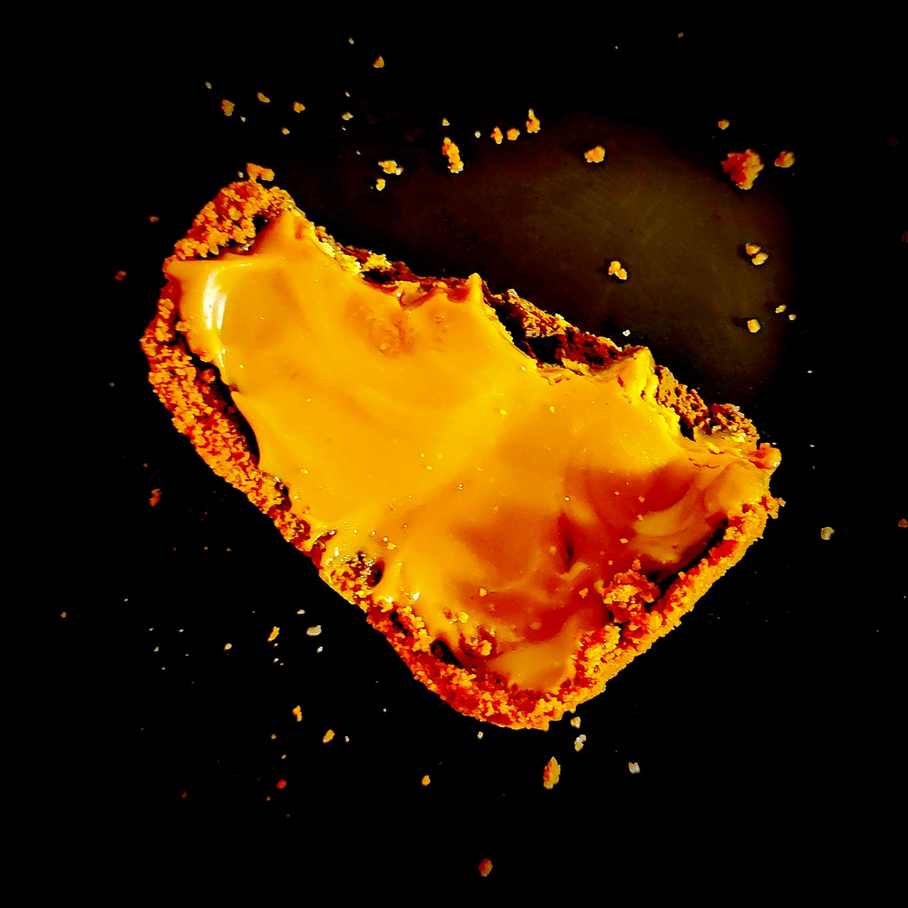

---

layout: recipe
title: "Carameloos Special"
image: carameloos-special/carameloos-special-1.jpg
tags: special, sans cuisson, speculoos, chocolat, caramel, sans four

components:
- Speculoos Crust
- Ganache chocolat noir
- Glaçage caramel à l’ancienne

ingredients:
- 1 crust Speculoos
- 150–200g de ganache chocolat noir
- 50–75g de glaçage caramel

directions:
- Tapissez un moule pouvant allant au réfrigérateur de papier cuisson en minimisant au maximum les plis.
- Foncez ensuite la pâte dans votre moule en prenant soin de bien tasser la base et les bords. Les bords doivent être suffisamment hauts pour accueillir la ganache et le glaçage – après à vous d'adapter les proportions aux différentes étapes du montage si vous voyez que les bords ne le sont pas assez. 
- Réservez au frais pendant au minimum 1 heure, il faut que cette base soit suffisamment solide pour accueillir le fourrage au beurre de cacahuète.
- Étalez la ganache au chocolat dans cette coque en Spéculoos.
- Réservez au frais pendant au minimum 30 minutes.
- Ajoutez enfin le glaçage caramel et lissez bien. Il devrait prendre assez vite sans avoir besoin de passer au réfrigérateur.

---

Les <i lang="en">Specials</i> sont des épiques avec peu d’ingrédients, sans cuisson, et réservés aux <i lang="en">cheat days</i> et célébrations. Ils viennent volontier couronner un objectif, progrès, ou plus généralement, tout accomplissement digne d’une tartelette XXL.

Le Carameloos Special peut se concevoir comme une tarte Speculoos-chocolat nappée de caramel.

Conservation&nbsp;: 5–7 jours dans une boîte hermétique au frigo.