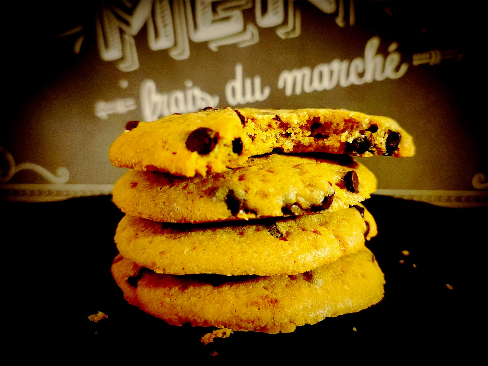

---

layout: recipe
title: "Cookies au beurre noisette"
image: browned-cookies/browned-cookies-1.jpg
tags: cookie, beurre de cacahuète, chocolat, snack, croquant, moelleux, beurre noisette, caramel

ingredients:
- 125g de farine
- 50g de sucre de canne complet ou muscovado
- 25g de sucre blanc
- 75g de beurre noisette (soit environ 90g de beurre)
- 1 œuf
- 1 cuillère à café de levure
- 50g de pépites de chocolat
- Extrait de vanille
- Pincée sel de Guérande 

components:
- Beurre noisette

directions:
- Versez le beurre noisette dans un saladier avec les deux sucres et fouettez vigoureusement pour obtenir une belle crème.
- Incorporez l’oeuf et la vanille.
- Ajoutez la farine et levure tamisées, les pépites de chocolat et le sel de Guérande et incorporez-les à la maryse sans trop travailler la pâte.
- Couvrez le bol avec du film alimentaire et réfrigérez la pâte au moins 1 h au frigo.
- Préchauffez votre four à 180°C.
- Réalisez des boules de cookies à l’aide d’une cuillère à glace, en les espaçant bien les unes des autres sur la plaque de cuisson – ils vont doubler de taille –, puis écrasez-lez légèrement avec la paume de la main.
- Enfournez pendant 12–15 minutes ou jusqu'à ce que leurs bords soient légèrement dorés. 
- Laissez les cookies continuer à cuire sur la plaque de cuisson encore 10 minutes avant de les transférer sur une grille.

---

Le cookie maison n’est pas le cookie industriel qui est soit moelleux soit croquant. Là on a le vrai cookie à l'américaine qui est croustillant dehors – la croûte – et bien moelleux dedans – le cœur. Il a l'air tout simple comme ça mais ce sont les ingrédients qui vont en faire une tuerie.

Notez qu’en jouant sur la quantité de sucre et de chocolat, vous pouvez contrôler comment le cookie va s'étaler. Plus il y aura de sucre, plus il sera fin, croquant, et large. Plus il y aura de chocolat, plus il sera haut, moelleux et, bien évidemment chocolaté.

Pour le cookie 100% américain, vous pouvez aussi remplacer la cuillère à café de levure par une 1/2 cuillère à café de levure et 1/2 cuillère à café de bicarbonate alimentaire.

 

Conservation&nbsp;: 3–5 jours dans une boîte non hermétique à l'abri de la chaleur et la lumière, en utilisant du papier cuisson ou de l'essuie-tout pour les séparer en étages si besoin. 2–3 mois au congélateur.