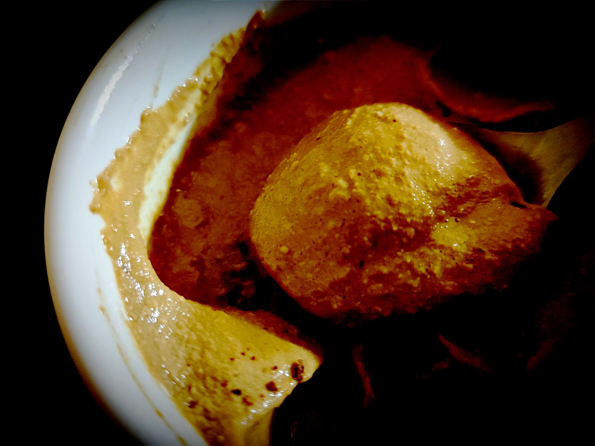

---

layout: recipe
title: "Crème de café"
image: creme-cafe/creme-cafe-1.jpg
tags: snack, crème, mousse, café, 3 ingrédients, sans cuisson, ramequin, chocolat, peu calorique

ingredients:
- 150g de tofu soyeux
- 25ml d’espresso (café très serré)
- 1 cuillère à café de sucre
- 2 carrés de chocolat noir

directions:
- Préparez un espresso puis laissez-le refroidir.
- Pendant ce temps, égouttez le tofu soyeux dans une passoire.
- Mélangez l’espresso froid avec le sucre.
- Si vous souhaitez une crème, fouettez/battez l’espresso avec le tofu soyeux. Si vous souhaitez une mousse, utilisez un mixer pour incorporer le maximum d’air au mélange – il faudra bien 5 minutes.
- Versez la crème/mousse dans un ramequin et laissez reposer 24 heures au frigo.
- Fabriquez un moule grossier en aluminium, légèrement plus petit que votre ramequin.
- 1 heure avant dégustation, faites fondre vos carrés de chocolat puis versez le dans votre moule maison sans prendre de précaution particulière – ce n‘est pas grave si le chocolat tranche, au contraire c’est quasiment ce que l’on recherche.
- Laissez prendre au moins 20 minutes au frigo, il faut que le chocolat redevienne liquide.
- Avant dégustation, griffez le chocolat à l’aide d’un couteau ou d’une fourchette. Vous pouvez même la mouiller pour aider le chocolat à bien trancher.
- Déposez le ensuite sur la crème en enfoncez-le légèrement pour créer l’illusion d’une tasse de café avec sa mousse au bord de la tasse vue du dessus.

---

La crème de café c'est une recette en trompe l’œil dans un ramequin. D’ailleurs ici on en fait qu’un donc il faudra multiplier les quantités si tu veux en faire plusieurs.

Recette à 4 ingrédients, c’est le batteur/mixeur qui va faire le plus gros du travail. Il faudra juste prévoir un passage de 24 heures au frigo pour que le mélange prenne.

Conservation&nbsp;: 2 jours au frigo.