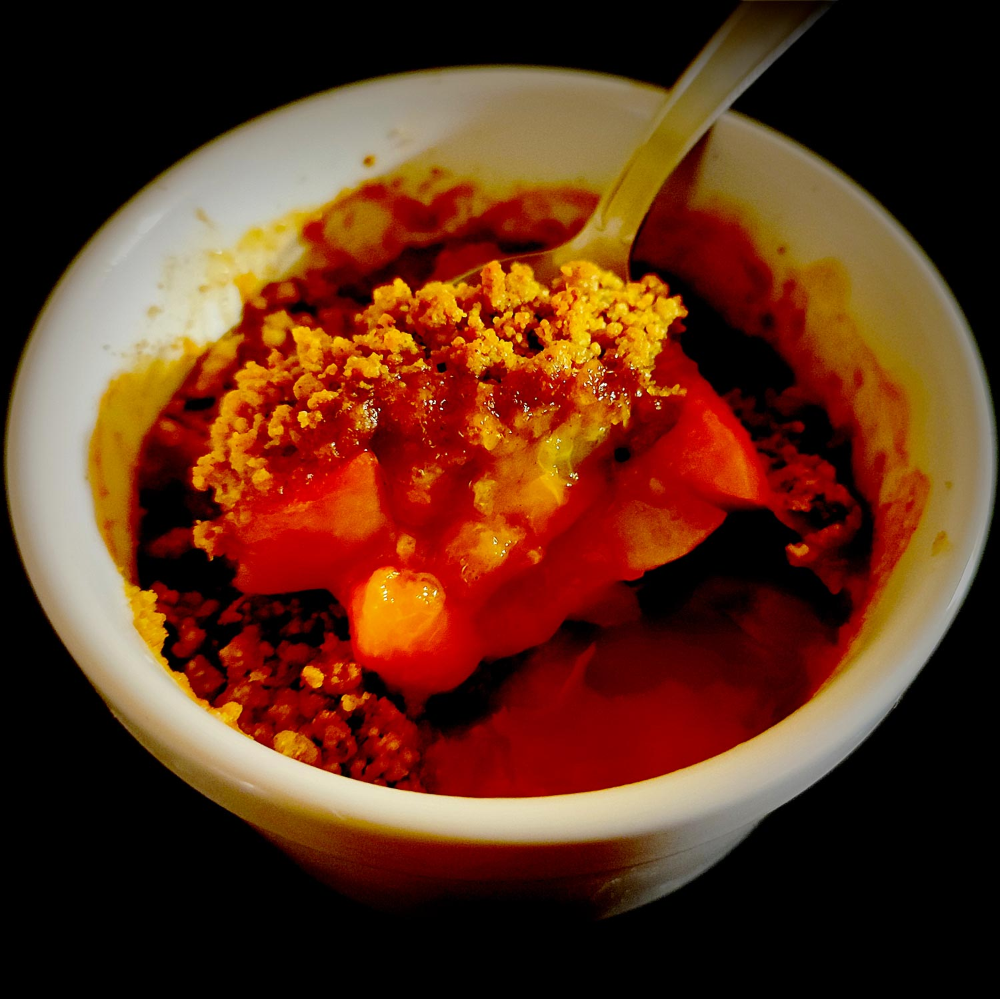

---

layout: recipe
title: "Crumble aux pêches et aux abricots"
image: crumble-fruits/crumble-fruits-1.jpg
tags: snack, crumble, de saison, pêche, abricot, sucre de canne, seigle

ingredients:
- 2 pêches
- 6 abricots
- 20g de sucre de canne complet
- 10cl de jus de citron

components:
- Crumble de canne

directions:
- Préchauffez le four à 190°C.
- Lavez et coupez les fruits en petits dés. 
- Placez-les dans un récipient et arrosez-les du jus de citron puis ajoutez le sucre complet. 
- Mélangez bien pour que les dés soient bien enrobés. 
- Graissez un plat à gratin (ou 4 ramequins) et déposez les fruits au fond.
- Répartissez la pâte à crumble sur les fruits dans le plat et enfournez pour 20–25 minutes ou jusqu'à ce que le crumble soit bien doré et forme une croûte.
- Laissez refroidir sur une grille. 

---

Le crumble de fruits, ça paraît simple au niveau de la liste d'ingrédients mais il faut les choisir pour qu’ils s'associent voire se complétent à la dégustation. 

Ici, le mariage entre l'abricot et la pêche est une valeur sûre mais on va un peu plus loin avec le sucre de canne complet qui amène une petite pointe de caramel, et la farine de seigle dans le crumble pour clôturer le thème de l'abricot. On aurait pu également utiliser de la farine d’amande.

On pense d'ailleurs très peu au goût de la farine utilisée dans les recettes mais elle peut mettre en exergue et apporter du relief à son ingrédient principal, comme la farine d'épeautre pour le caramel pour autre exemple, ou la noisette avec le café.

Le crumble aux fruits peut se manger tiède ou froid, nature ou accompagné d'une boule de glace ou de crème fouettée. Pour la variante allégée, regardez du côté du yaourt grec ou du Cottage cheese.

Conservation&nbsp;: 48 heures au frigo, ramequin recouvert de film alimentaire.