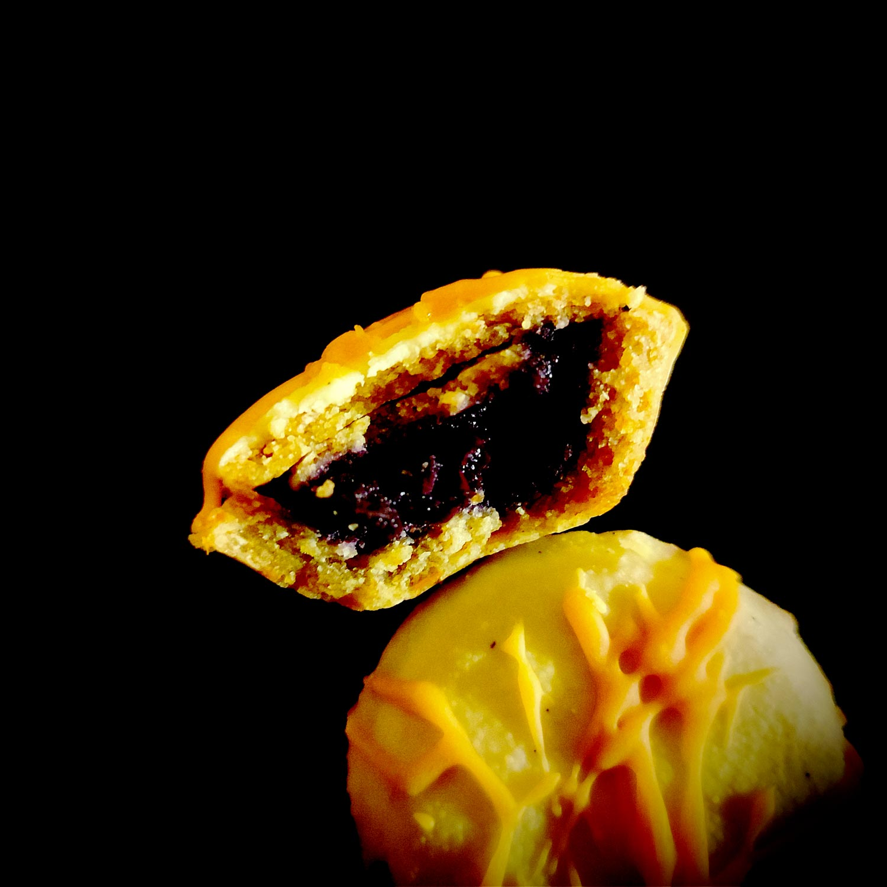

---

layout: recipe
title: "Tartelettes Crunch’ Em"
image: crunchem/crunchem-1.jpg
tags: tartelette, myrtille, fruit, Dinosaurus, seigle, beurre de cacahuète, chocolat blanc

ingredients:
- 80–100g de chocolat blanc
- 1 cuillère à soupe d’huile de coco (facultatif)

components:
- Pâte sablée Dinosaure
- Beurre de myrtille
- Glaçage au beurre de cacahuète

directions:
- Préchauffez le four à 180°C.
- Abaissez la pâte sur une épaisseur de 4 mm environ et découpez des ronds à l'aide d'un emporte pièce. 
- Foncez-les dans votre moule à mini tartelettes. Assurez-vous d'avoir une belle épaisseur homogène pour que le biscuit, une fois cuit, ne casse pas. 
- Si vous constatez des craquelures après avoir foncé la pâte n'hésitez pas à les combler en utilisant de la pâte supplémentaire comme rustine – après cuisson vous vous rendrez compte que le dessous sera vraiment pas mal craquelé sur certaines tartelettes.  
- Remplissez le fond avec du beurre de myrtilles quasiment à ras bord soit environ 1 cuillère à café, mais en laissant un espace suffisant pour souder les bords de la tartelette. 
- Découpez un autre bout de pâte à l'aide d'un emporte pièce légèrement plus petit et refermez la tartelette. 
- Prenez soin de bien souder les bords afin que le beurre de myrtilles ne s'échappe pas à la cuisson. 
- Si vous ne comptez pas ajouter un glaçage/nappage vous pouvez napper le dessus des tartelettes de lait (et/ou jaune d'œuf) pour bien les faire dorer. 
- Enfournez pour 15-20 minutes ou jusqu'à ce que le dessus soit solide au toucher, et les bords légèrement dorés.
- Essayez de démouler assez rapidement les tartelettes, quitte à les faire refroidir à l'envers sur la tête, puisque le biscuit va durcir en refroidissant. Si la cuisson du biscuit est bonne – et le moule a été bien graissé/préparé –, elles devraient se démouler quasiment d'elles-mêmes sans effort.
- Laissez refroidir les tartelettes avant de les napper.
- Faites fondre le chocolat blanc et nappez-en le dessus des tartelettes en les trempant dans le bol puis laissant couler l'excédent. 
- Laissez refroidir sur un papier cuisson à température ambiante ou, pour les plus pressés, 20 minutes au frigo. 
- Une fois le chocolat refroidi et durci, coulez des traits de glaçage au beurre de cacahuète pour finaliser la tartelette.
- Laissez refroidir une dernière fois à l'air libre ou au réfrigérateur. 

---

Les tartelettes Crunch’ Em sont des bouchées snack qui marient le beurre de cacahuète et la myrtille dans un format original.

Si vous comptez transporter les tartelettes ou qu'il fait chaud, ajouter de l'huile de coco fondue pourra aider à solidifier le nappage au chocolat même s'il ne faut pas non plus espérer de trop gros miracle – elle se fige en dessous de 25°C.

Conservation&nbsp;: 4–5 jours dans une boîte (pas besoin qu'elle soit hermétique) à l'abri de la lumière et de la chaleur.