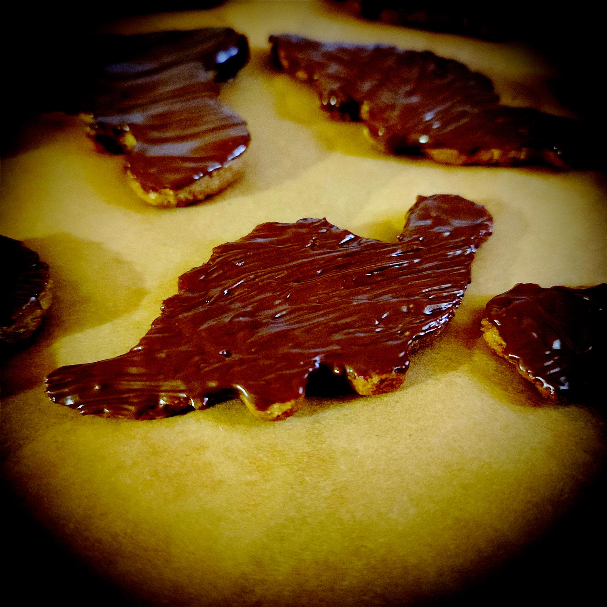

---

layout: recipe
title: "Biscuits Dinosaure"
image: dino/dino-1.jpg
tags: snack, biscuit, cannelle, chocolat, nappage, Dinosaurus

ingredients:
- 100–120g de chocolat noir
- lait pour dorure

components:
- Pâte sablée Dinosaure

directions:
- Préchauffez le four à 180°C.
- Abaissez la pâte sur 5 mm d'épaisseur puis découpez des dinosaures avec l’aide d’un emporte-pièce.
- Déposez les biscuits sur une plaque de cuisson. Si ça vous tente, vous pouvez dessiner la bouche, les yeux, écailles, etc.
- Badigeonnez les biscuits dinosaures de lait puis enfournez pour 15-20 minutes dans un four préchauffé à 180°C ou jusqu'à ce que les bords soient légèrement dorés.
- Mettez les biscuits sur une grille et laissez les refroidir. 
- Une fois les dinosaures à température ambiante, faites fondre le chocolat au bain-marie ou au micro-ondes.
- Badigeonnez un côté de chaque biscuit avec du chocolat noir fondu puis placez-les sur une feuille de papier sulfurisé afin que le chocolat puisse figer.

---

L’inspiration de ces biscuits est je pense assez claire. Le point le plus important, c’est de choisir un bon chocolat parce qu’on va bien le sentir en bouche.

Ma technique quasiment infaillible pour le nappage, c'est de faire fondre ⅔ du chocolat au micro ondes en 3 fois 30 secondes en mélangeant bien les morceaux entre chaque section, puis d'incorporer le ⅓ restant dans le chocolat fondu pour le faire revenir à la bonne température.

Conservation&nbsp;: 1 semaine dans boîte hermétique à l'abri de la chaleur et de la lumière. Ça peut se congeler aussi mais il faudra évidemment les décongeler dans le frigo puis à température ambiante, et éviter le micro-ondes, étant donné qu'ils sont nappés de chocolat.