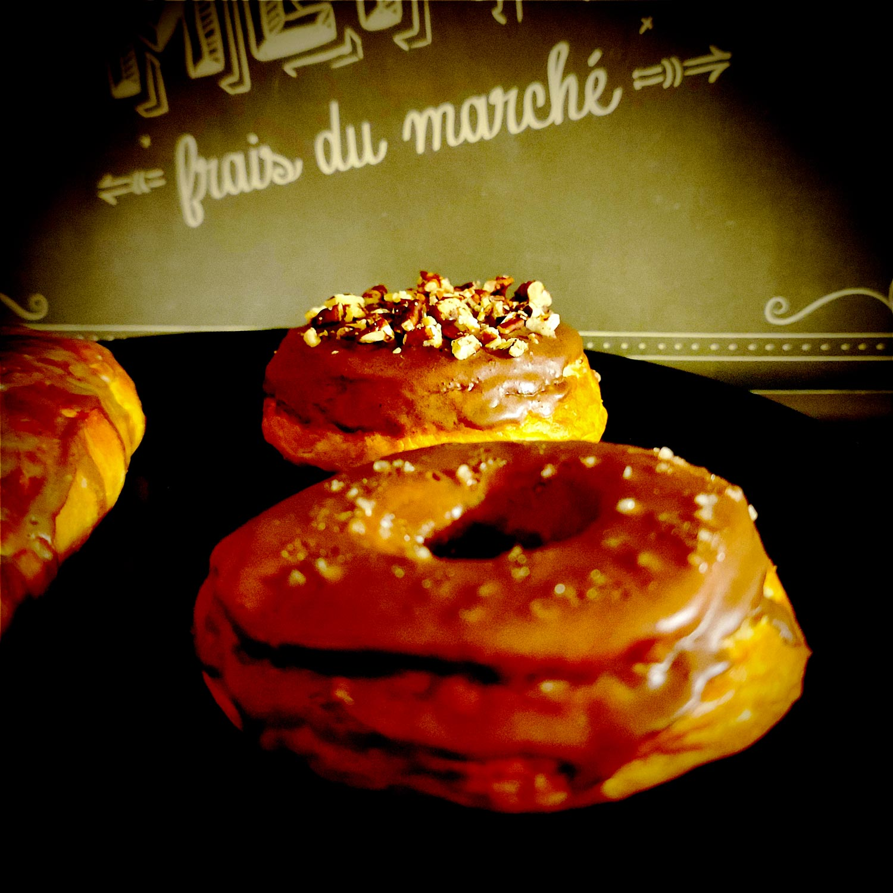

---

layout: recipe
title: "Donut bretzel"
image: donut-bretzel/donut-bretzel-1.jpg
tags: snack, cannelle, cacao, bretzel, gros sel, levure boulangère, lait, bicarbonate, repos, levée, boulangerie, sans œuf

ingredients:
- 250g de farine T55
- 150ml de lait
- 30g de beurre très mou
- 5g de levure sèche ou 10g de levure fraîche
- 15g de sucre en poudre
- ½ cuillère à café de sel
- 1.5L d’eau
- 40g de bicarbonate alimentaire
- gros sel
- poignée de noix de pécan concassées (facultatif)

components:
- Glaçage cacao
- Glaçage cannelle

directions:
- Si besoin, réhydratez votre levure dans le lait tiède et le sucre.
- Dans un grand bol, mélangez la farine et le sel.
- Ajoutez la levure, le lait tiède, le sucre et le beurre. 
- Bien pétrir jusqu'à ce que la pâte ne colle quasiment plus aux doigts – au robot, quand la pâte se décolle des parois, pas plus. Elle doit néanmoins rester bien souple, donc ajustez farine et liquide en conséquence. 
- Laissez lever le mélange recouvert d’un torchon dans un endroit chaud pendant 1h30–2h. Elle devrait avoir doublé de volume au bout de ce laps de temps.
- Sur un plan de travail légèrement fariné – moins que d'habitude, la pâte doit rester un tout petit peu collante –, abaissez la pâte.
- Façonner des bretzels, des donuts ou des petites baguettes puis déposez-les délicatement sur la plaque de cuisson en les espaçant bien. Couvrez-les d’un torchon propre pour une seconde levée de 30 minutes environ.
- Préchauffez le four à 200°C.
- Faites bouillir de l’eau dans une casserole avec le sel et le bicarbonate puis baissez la température pour avoir une eau tout juste frémissante.
- Plongez ensuite les bretzels un par un dans l’eau frémissante, et attendez qu’ils remontent pour les sortir avec un écumoire et les égoutter sur de l’essuie-tout. Le passage dans le bain doit être rapide, environ 10–15 secondes.
- Si vous souhaitez un bretzel nature, entaillez le dessus des bretzels et saupoudrez de gros sel. Sinon, sautez cette étape.
- Disposez les bretzels sur une plaque recouverte de papier sulfurisé.
- Enfournez pendant 12-20 minutes où jusqu’à ce que le bretzel ait bien bruni, que les entailles se soient développées, et qu’il sonne creux quand vous tapotez le dessous.
- Attendez quelques minutes avant de disposer les bretzels sur une grille de refroidissement. Si vous faites des bretzels nature, arrêtez-vous là.
- Une fois les bretzels refroidis, déversez le glaçage cacao ou cannelle par dessus, puis saupoudrez du gros sel ou des morceaux de noix de pécan, etc.
- Laissez le glaçage se figer – soit à température ambiant soit par un passage rapide au frigo – avant de déguster. 

---

Le bretzel c’est très bon nature, c’est également délicieux en sandwich, mais c’est un peu moins connu en version sucrée – en l’occurence en donut ici. L’idée c’est d’amener du contraste pour mettre en avant le goût salé du bretzel, et le sucré de son glaçage.

Pour la glaçage on joue la valeur sûre&nbsp;: chocolat noir/cacao et gros sel. Ça existe sous forme de tablette de chocolat, c’est simple, basique, et on sait que ça fonctionne. Mais il y en a plein d’autres qui peuvent se tenter&nbsp;: caramel, beurre de cacahuète, et sirop d’érable devraient tout aussi bien fonctionner que le chocolat noir. Et les plus aventureux pourront tenter des choses beaucoup plus originales ou contrastées.

Note&nbsp;: Si tu préfères une pâte à donut un peu plus aérée pour réaliser ces bretzels, il suffit d’ajouter un œuf à la pâte. Le reste fonctionne de la même façon.

Conservation&nbsp;: 3–5 jours dans une boîte à l’abri de la lumière et de la chaleur ou emballé dans un torchon comme le pain. 2–3 mois au congélateur.