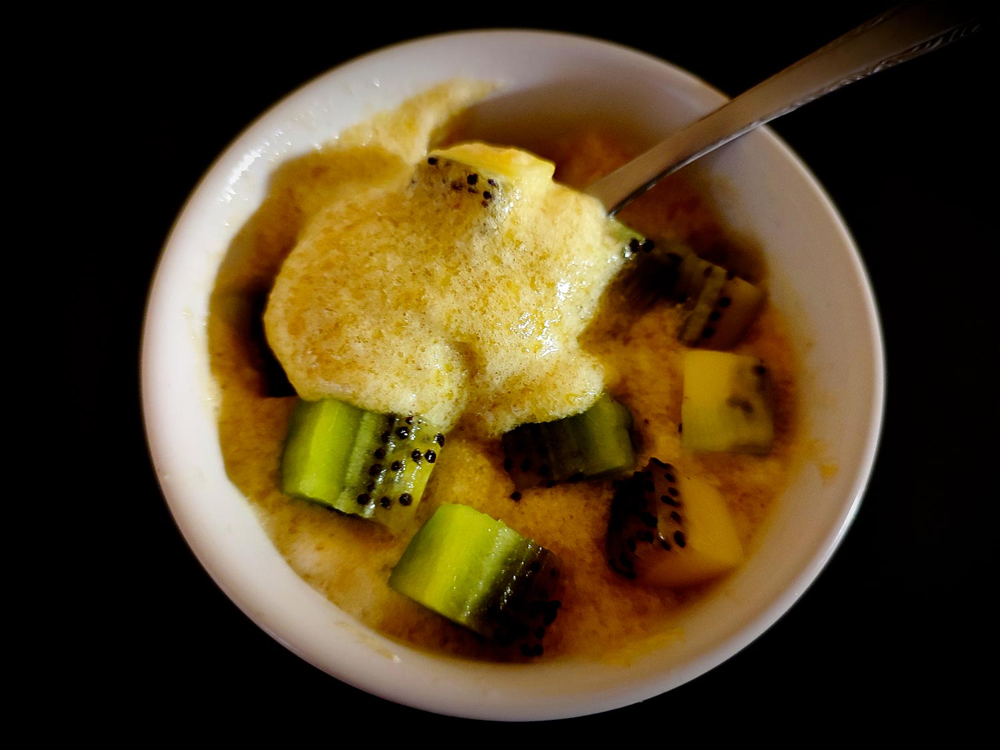

---

layout: recipe
title: "Écume de banane et de mangue"
image: ecume-banane/ecume-banane-1.jpg
tags: dessert, mousse, banane, manque, kiwi, blanc d’œuf, léger, sans cuisson

ingredients:
- 2 bananes
- 1 mangue
- 2 blancs d’œuf
- 1 kiwi
- 1/2 cuillère à café de jus de citron

directions:
- Épluchez et découpez la mangue en morceaux.
- De même avec la banane.
- Mixez les 2 avec le jus de citron pour obtenir une purée liquide mais encore un peu épaisse.
- Montez les blancs en neige.
- Incorporez-les tout doucement à la purée de banane et de mangue, on veut conserver le maximum d’air.
- Versez dans des ramequins et laissez prendre au frigo au minimum 30 minutes.
- Avant de servir, éplucher et découpez le kiwi en petits dés et disposez-les sur l'écume de banane et de mangue.

---

L’écume de banane et de mangue, c’est un petit dessert ultra léger qui vient clôturer un repas l’été. Elle fond littérallement sur la langue et amène une légère note sucrée toute douce qui va bien – surtout avec la chaleur, la douceur et la légèreté.

L’un de ces principaux intérêts, c’est que la recette permet également d’écouler les blancs d’œuf qui trainent.

Si vous voulez quelque chose de plus mousseux il faudra utiliser du gélifiant. Sans, ça rappelle la consistance de l’île flottante, ça gigote un peu quand on remue, ça fait danser les dés de kiwi au lieu de les supporter complètement.

