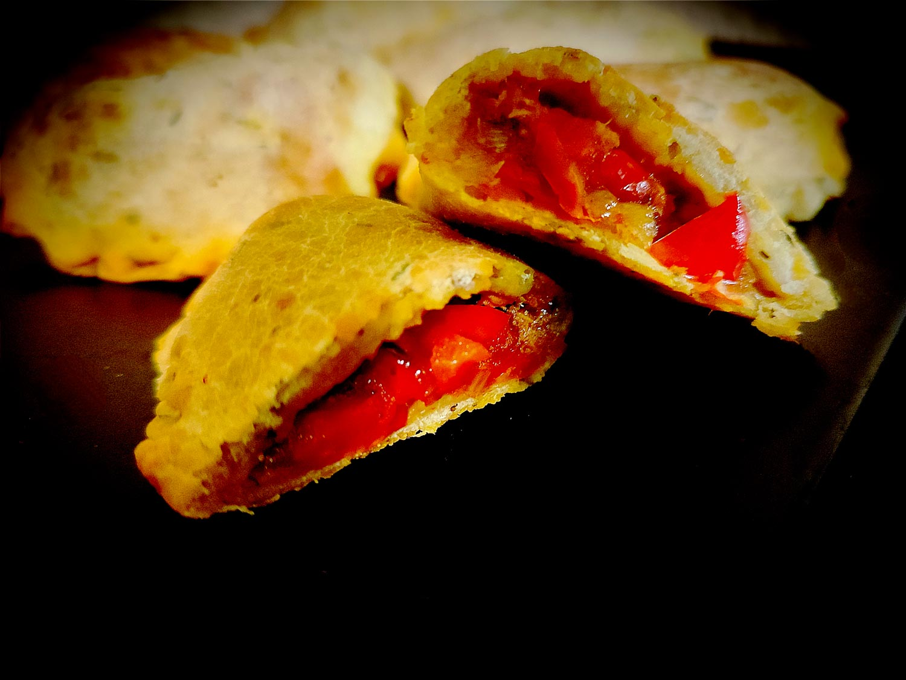

---

layout: recipe
title: "Empanadas"
image: empanadas/empanadas-1.jpg
tags: apéro, salé, thon, pâte brisée

components:
- Pâte brisée au fromage blanc

ingredients:
- 1 pâte brisée
- 1 boîte de thon à la tomate
- eau
- 1 échalotte (facultatif)
- lait pour dorure (facultatif)

directions:
- Préchauffez le four à 180°C – ou à la température indiquée sur le paquet de pâte brisée.
- Déroulez votre pâte et découpez des ronds à l’aide d’un emporte pièce.
- Épluchez et émincez l’échalotte, mélangez-la au thon à la tomate.
- Déposez une cuillère à soupe de thon à la tomate au centre de chaque rond.
- Humidifiez les bords avec de l’eau puis repliez-le pour former un chausson.
- Pressez les bords pour bien les souder afin qu’ils ne s’écartent pas à la cuisson – vous pouvez utiliser une fourchette.
- Disposez vos chaussons sur une plaque de cuisson en laissant un peu d’espace entre chaque.
- À l’aide d’un pinceau, disposez du lait sur le dessus des chaussons.
- Enfournez pour 15–20 minutes ou jusqu’à ce que les bords soient bien dorés.

---

Encore une recette d’assemblage pour l’apéro, avec des empanadas au thon, soit des petits chaussons contenant du thon en boîte.

