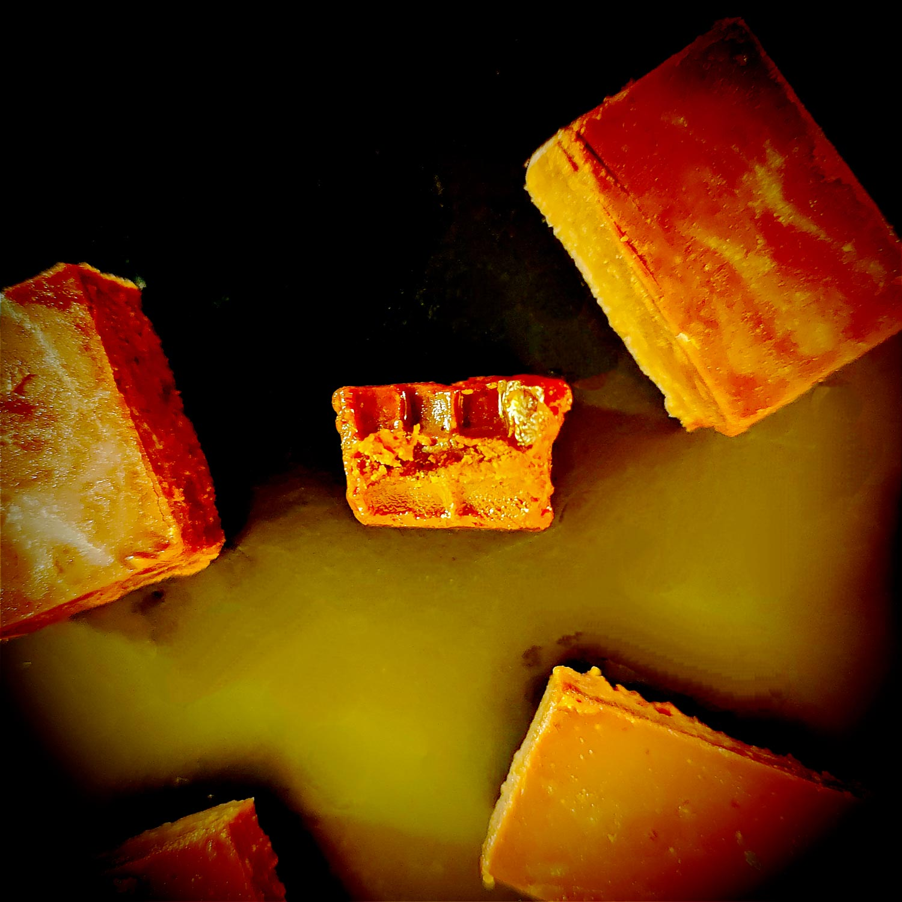

---

layout: recipe
title: "Fudge au chocolat noir"
image: fudge/fudge-1.jpg
tags: snack, chocolat, bouchée, fêtes, noël, sans cuisson, sans four

ingredients:
- 100g de chocolat noir
- 85g de sucre glace
- 85g de beurre
- 40ml de lait
- extrait de vanille

directions:
- Recouvrez un plat à gratin de papier cuisson en laissant du papier en plus sur 2 côtés pour pouvoir le soulever plus facilement. Assurez-vous qu’il puisse aller au frigo.
- Faites fondre le beurre, le lait, l'extrait de vanille et le chocolat au micro-ondes en plusieurs fois, en mélangeant entre chaque itération. 
- Ajoutez le sucre glace tamisé dans le mélange encore chaud et mélangez bien pour l'intégrer sans grumeau et obtenir une texture lisse.
- Versez le tout dans le plat à gratin, égalisez et lissez.
- Laissez prendre votre fudge pendant au moins 6 heures au frigo.
- Une fois la fudge bien pris, vous pouvez le retirer du plat à gratin et le découper en petits dés.

---

Le <i lang="en">fudge</i>, c‘est la recette sans prise de tête qu’on peut faire rapidement au micro-ondes. C'est assez typique des fêtes de fin d’année en famille dans la culture américaine – et anglaise, aussi. 

Ça veut aussi dire que c’est une période où tu ne regardes pas trop les calories, je préfère le faire remarquer vu la richesse du snack – on a quasiment autant de lipides que de glucides et ça, c‘est vraiment vraiment le pire pour faire vriller ton cerveau et tomber dans le snacking incontrôlable au goûter.

Donc tu as bien compris je l’espère que c'est une recette à partager, si possible avec un maximum de personnes. Ou alors si tu as la force mentale d’un moine bouddhiste et que tu es capable de t’arrêter après 2 petits cubes d’un demi-centimètre, ça te fera ton snack de 4 heures pour les 3 prochaines semaines.

Conservation&nbsp;: 2–3 semaines au frigo.