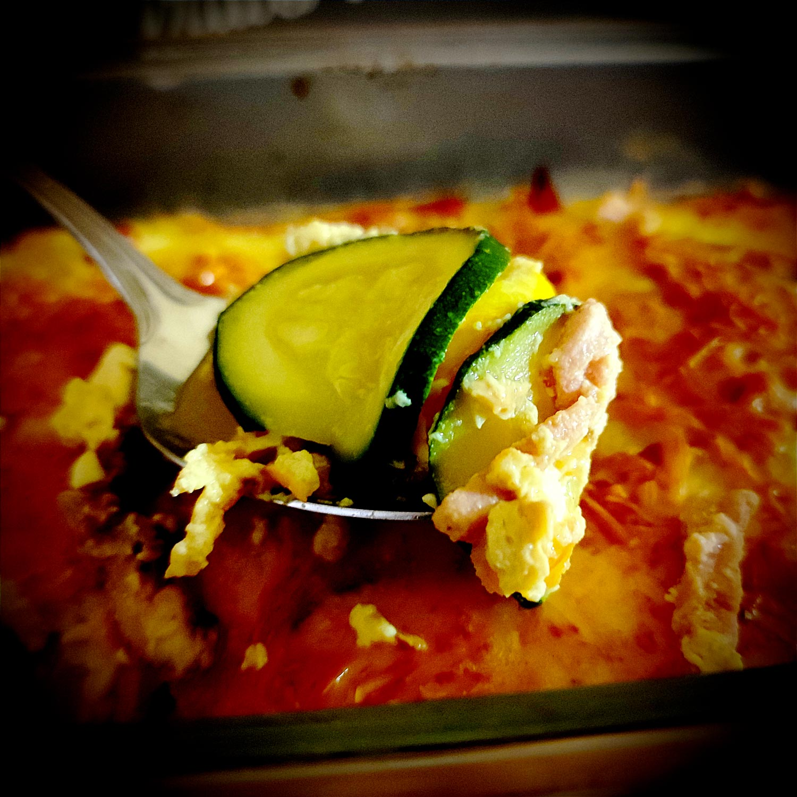

---

layout: recipe
title: "Gratin de courgettes"
image: gratin-courgette/gratin-courgette-1.jpg
tags: plat, salé, gratin, légume, courgette, poulet, fromage

ingredients:
- 4 courgettes
- 150g d’allumettes de jambon ou de poulet, ou lardons végétaux
- 4 œufs
- 200g de crème épaisse (allégée)
- 100g d’emmental râpé 
- Sel
- Poivre
- Muscade

directions:
- Préchauffez le four à 190°C.
- Faites revenir les courgettes à feu vif dans une poêle avec un peu d’huile pour faire évaporer l'eau au maximum.
- Disposez-les dans un plat à gratin légèrement beurré/huilé.
- Faites rissoler les lardons dans la même poêle. Vous pouvez zapper cette étape si vous avez la flemme.
- Parsemez-les ensuite sur la couche de courgettes.
- Préparez l’appareil/sauce en battant les oeufs avec la crème fraîche. 
- Salez, poivrez. 
- Ajoutez une pointe de muscade. 
- Nappez les courgettes de cette sauce.
- Passez au four 15–20 minutes environ ou jusqu’a ce que le fromage soit bien gratiné. 
- Servez chaud.

---

Un gratin pas trop compliqué avec peu d’ingrédients et qui peut se préparer la veille pour mise au four le lendemain. Il faudra juste à minima prévoir une cuisson rapide des courgettes à la poêle pour qu’elles rendent le maximum d’eau et évitent de transformer votre gratin en piscine.

