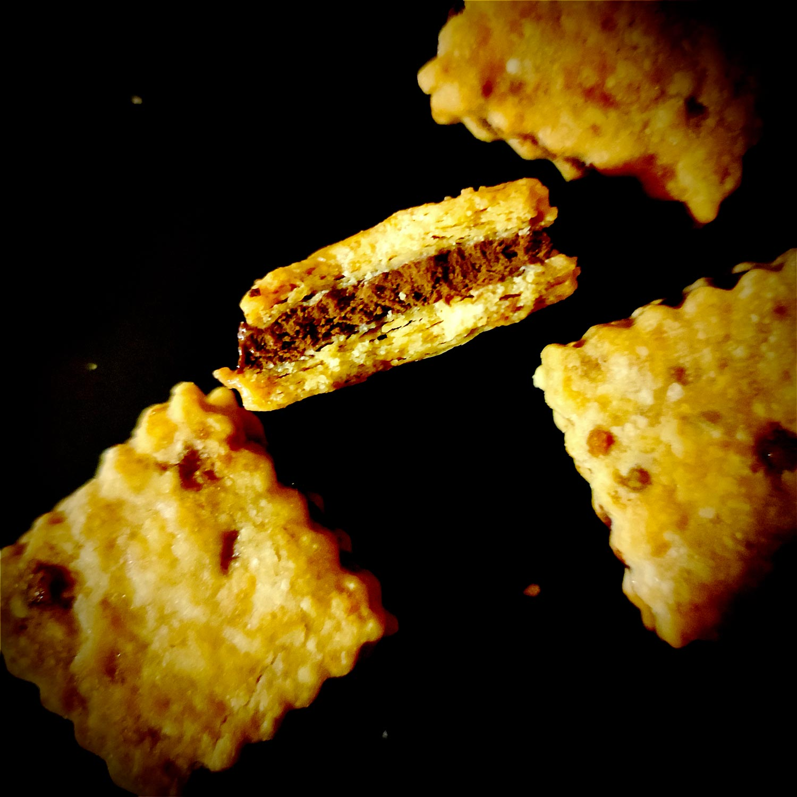

---

layout: recipe
title: "Millionaire Cookie Sandwich"
image: millionnaire-sandwich/millionnaire-sandwich-1.jpg
tags: snack, biscuit, épeautre, beurre, shortbread, caramel, ganache, chocolat noir, muscovado, cookie

components:
- Ganache chocolat noir

ingredients:
- 90g de farine d’épeautre
- 60g de beurre demi sel
- 30g de sucre muscovado
- extrait de vanille
- 100g de ganache chocolat noir
- lait (facultatif)

directions:
- Crémez le beurre avec le sucre muscovado. Celui-ci étant moins raffiné que le sucre blanc, il y a quelques impuretés. Pas de panique, nous voulons justement les conserver dans le biscuit.
- Ajoutez l’extrait de vanille et mélangez.
- Tamisez la farine incorporez-la à la crème de beurre sucrée. Ne travaillez pas trop la pâte, il faut simplement ne plus apercevoir de grumeau.
- Aplatissez la pâte puis emballez-la dans un film et laissez reposer au moins 2 heures au frigo. Si vous pensez qu’elle est trop friable, ajouter une cuillère à café de lait.
- Préchauffez le four à 160°C.
- Abaissez la pâte avec une épaisseur d’environ 4–5mm puis découpez vos biscuits à l’aide d’un emporte-pièce. Si celle-ci encore trop friable, vous pouvez ajouter une cuillère à café de lait pour la rendre un peu plus élastique.
- Disposez-les sur une plaque de cuisson et enfournez pour 25 à 30 minutes ou jusqu’à ce que le biscuit se tienne et soit légérement doré aux bords, pas plus. Le biscuit ne doit pas être dur à la sortie du four, il doit y avoir un léger rebond quand vous appuyez dessus. 
- Faites refroidir sur une grille.
- Pendant ce temps, sortez votre ganache chocolat noir du frigo.
- Prenez votre ganache au chocolat et fouettez-la un peu si elle n’est pas assez élastique.
- Prenez un biscuit et disposez une boule de ganache sur celui-ci (à l’aide d’une spatule, cuillère, ou poche à douille).
- Prenez un autre biscuit et formez un sandwich en aplatissant bien la ganache entre les 2.
- Faites prendre au moins 20 minutes au réfrigérateur.

---

Il n’y a pas que les cookies Oreo dans la vie, il y a aussi le <i lang="en">millionaire shortbread</i> sous forme de sandwich. Même concept mais ingrédients d’une qualité mille fois supérieure, et sans conservateur.

Le <i lang="en">millionaire shortbread</i>, c’est un peu un Twix simplifié&nbsp;: une base en biscuit <i lang="en">shortbread</i>, une couche de caramel, et une couche de chocolat. Simple, efficace, délicieux. 

Le <i lang="en">millionaire sandwich</i>, c’est une ganache au chocolat entre 2 biscuits <i lang="en">shortbread</i> au bon goût de caramel. Et pour aller au bout du raisonnement, on utilise de la farine d’épeautre qui se marie particulièrement bien au caramel. 

Le plus important dans cette recette, c’est le sucre car c’est lui qui va amener la note de caramel dans le biscuit. Et là, le top du top c’est le sucre Muscovado. Sans celui-ci, il manquera un peu de <i lang="en">flair</i> à ton sandwich. Tu peux essayer avec du sucre de canne complet ou du Rapadura, mais le goût sera beaucoup moins prononcé.

Quant au chocolat de la ganache, n’hésite pas à prendre le plus riche en cacao possible. Ça aménera un contraste hyper intéressant avec le sucré caramel.

Conservation&nbsp;: 5–7 jours dans une boîte à biscuit avec du papier cuisson pour absorber l’humidité.