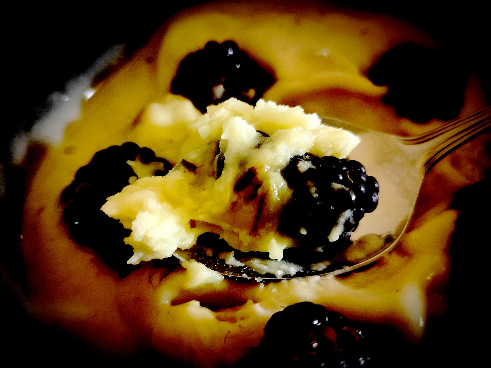

---

layout: recipe
title: "Nice cream"
image: nice-cream/nice-cream-1.jpg
tags: dessert, ice cream, banane, glace, blender, mixer, sans cuisson, soft-serve, healthy, sans sorbetière

ingredients:
- 2 bananes mûres coupées en tranches et congelées
- 2–4 cuillères à soupe de lait ou boisson végétale
- extrait de vanille (facultatif)
- suppléments au choix (facultatif)

directions:
- Versez les tranches de banane congelées directement dans le blender et commencez à mixer. Il faut que votre blender puisse tourner à haute vitesse ou, à défaut, dispose d’une fonction pour piller la glace.
- Une fois que le plus gros de la banane est mixé – n’hésitez pas à arrêter le blender pour racler les bords –, ajoutez du lait/boisson végétale cuillère à soupe par cuillère à soupe.
- Ajoutez vos extraits/suppléments et mixez tout juste pour les incorporer.
- Servez immédiatement ou remettez votre nice cream au congélateur pour 1 heure.

---

Gros classique de la flemme de grandes chaleurs qui sait toutefois rester <i lang="en">healthy</i>/santé, la <i lang="en">nice cream</i> serait presque un <i lang="en">cheat code</i> de la vie pour s’offrir un petit plaisir absolument pas coupable ou presque, sans sorbetière.

La texture est celle d’une crème glacée ni trop solide ni trop liquide, juste un peu fondue. C’est que que les anglophones décrivent par <i lang="en">soft serve</i>. Ça se déguste idéalement en sortie de blender par conséquent. Mais si tu préfères un peu plus dur, tu peux remettre au congélateur pour une petite heure.

Le résultat doit être bien crémeux et onctueux. Ça ne devrait pas donner l’impression d’être une ersatz de crème glacée vendue 7&nbsp;€ en supermarché. Et puis l’intérêt c’est aussi de faire ses propres parfums et mélanges, avec de la <i lang="en">cookie dough</i>, ou des rubans de caramel, du cacao, des pépites de chocolat, du beurre de cacahuète, etc.

