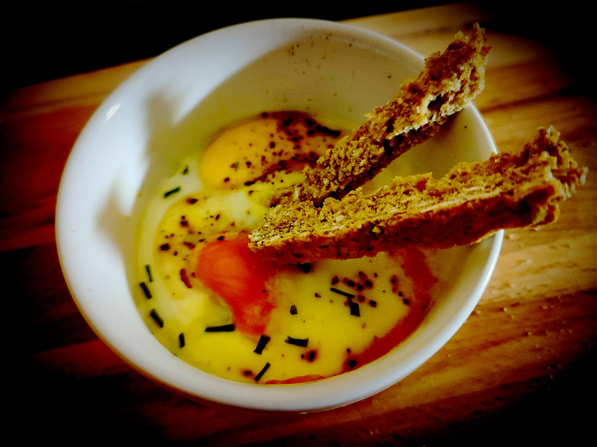

---

layout: recipe
title: "Œuf cocotte à la truite"
image: oeuf-cocotte-truite/oeuf-cocotte-truite-1.jpg
tags: entrée, salé, truite, crème fraîche

ingredients:
- 1 tranche de truite ou de saumon fumé
- 1 œuf
- 2 cuillères à soupe de crème épaisse entière 30%
- poivre
- ciboulette

directions:
- Préchauffez le four à 190°C.
- Dans le ramequin beurré/huilé, repartir 1 cuillère à soupe de crème et la moitié d'une tranche de saumon découpée en morceaux/lanières.
- Cassez ensuite l’œuf en prenant soin de ne pas casser le jaune.
- Disposez enfin l'autre moitié de la tranche et une dernière cuillère de crème. 
- Saupoudrez de poivre.
- Enfournez 10–15 minutes ou jusqu'à ce que ça ne gigote quasiment plus au centre. 
- Ajoutez la ciboulette à la sortie du four.

---

Une entrée sans chichi qui ne demande que très peu de préparation. Logiquement il faudrait une cuisson au bain-marie au four à plus basse température pour réaliser un œuf cocotte parfait, mais on arrive pas trop mal à se débrouiller sans en surveillant bien la cuisson.

