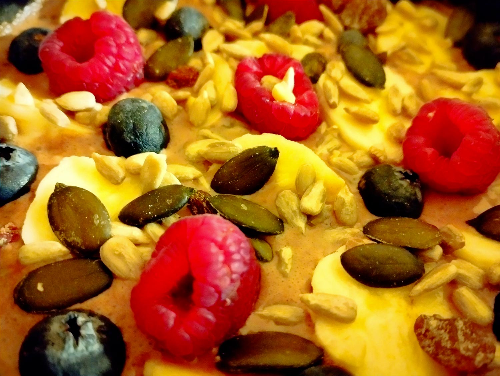

---

layout: recipe
title:  "Overnight oats"
image: overnight-oats/overnight-oats-1.jpg
tags: petit déjeuner, avoine, froid, sans cuisson, lendemain, fruits rouges, yaourt

ingredients:
- 35–40g de flocons ou son avoine
- 1 cuillère à café de graines de chia
- 5cl de lait ou boisson végétale
- 1 pot de yaourt
- 1 banane
- 25g de framboises
- 25g de myrtilles
- 15g de mélange graines ou noix
- 15g de cacao amer en poudre (facultatif)
- 2g de miel (facultatif)

directions:
- Déposez les flocons d’avoine dans un contenant/bocal allant au frigo.
- Ajoutez une cuillère à café de graines de chia.
- Ajoutez du cacao en poudre si vous souhaitez une version chocolatée.
- Versez le lait et mélangez bien. Il faut en effet disperser au mieux les graines de chia puisque celles-ci vont gonfler au contact prolongé du lait (concept du pudding de chia).
- Ajoutez le yaourt et mélangez une dernière fois.
- Vous pouvez soit ajouter les autres ingrédients le lendemain matin, soit les ajouter maintenant.
- Découpez la banane en tranches et disposez-les sur votre gruau.
- Faites de même avec les framboises et les myrtilles.
- Le lendemain, avant de déguster, versez une poignée de graines ou de noix et un peu de miel si vous êtes un bec sucré.

---

Les <i lang="en">overnight oats</i>, ce sont des flocons ou du son d’avoine trempés la veille pour le petit déjeuner du lendemain. C’est le petit déjeuner parfait pour enchaîner sur une grosse journée ou une sortie sportive.

On peut éventuellement le voir comme la version froide et sans prise de tête du porridge&nbsp;: zéro cuisson et une liberté totale sur les ingrédients&nbsp;!

Conservation&nbsp;: 48 heures au frigo.