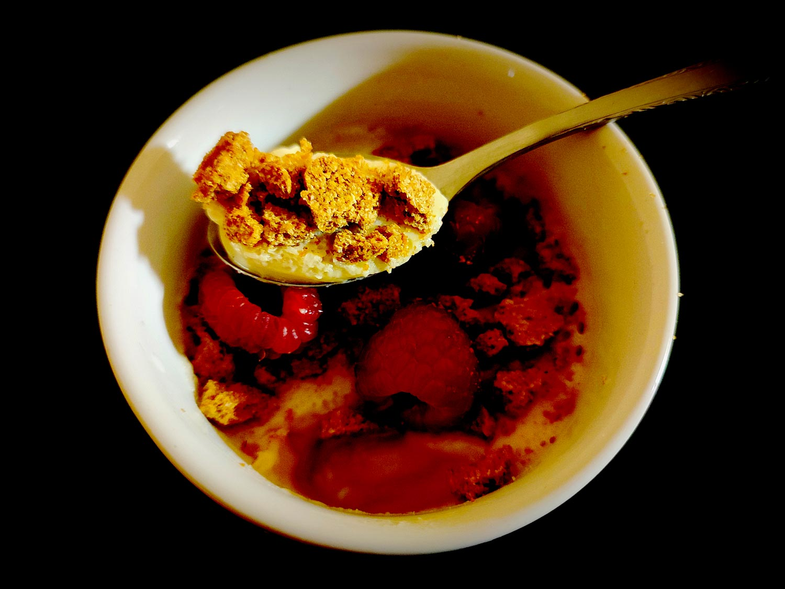

---

layout: recipe
title:  "Pannacotta amande framboise Spéculoos"
image: panacotta/panacotta-1.jpg
tags: dessert, froid, sans cuisson, framboise, amande, speculoos, lait fermenté

ingredients:
- 10cl de boisson végétale à l’amande intense
- 10g de sucre de canne complet
- le gélifiant de votre choix
- 1 poignée de framboises
- 2 biscuits Speculoos 
- ½ cuillère à soupe de jus de citron 

directions:
- Ajoutez le jus de citron dans le lait d’amande et mélangez.
- Laissez le lait fermenter pendant au moins 10 minutes, il devrait être bien épaissi et avoir la consistance d'une crème après le temps imparti.
- Réhydratez le gélifiant si besoin afin qu’il soit prêt à être intégré à la préparation une fois celle-ci chaude.
- Mélangez le lait fermenté puis chauffez-le avec le sucre jusqu’à ébullition. 
- Laissez frémir quelques secondes. 
- Ôtez la casserole du feu et ajoutez le gélifiant.
- Mélangez pour bien le distribuer. 
- Versez dans une verrine ou un ramequin.
- Laissez tiédir à l’air libre puis placez la pannacotta au moins 2–3 heures au réfrigérateur pour qu’elle prenne. 
- Avant dégustation, ajoutez les biscuits emiettés et une poignée de framboises.  

---

La <i lang="it">pannacotta</i> est un peu le dessert italien en verrine que l’on a tendance à oublier mais qui, quand les ingrédients sont bien associés, peut clotûrer un repas sur une note toute douce.

La particularité de cette recette, c’est qu’on utilise une boisson végétale à l’amande plutôt que du lait, et qu’on la fermente en plus pour obtenir quelque chose de bien crémeux.

Conservation&nbsp;: 48 heures au frigo.