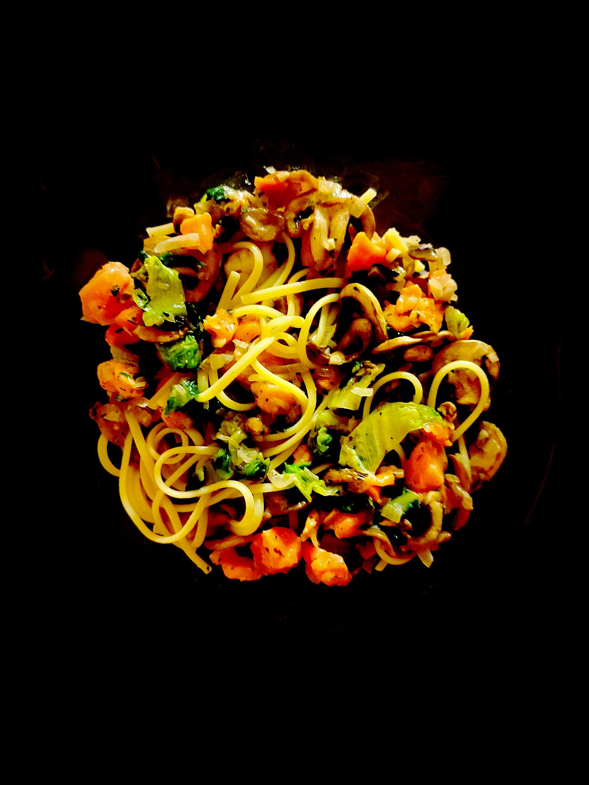

---

layout: recipe
title: "Pâtes au saumon"
image: pates-saumon/pates-saumon-1.jpg
tags: entrée, plat, saumon, pâtes, semoule, farine complète, sucrine, oignon, champignon

ingredients:
- 160g de spaghetti à la semoule de blé ou farine complète
- 1 sucrine
- 1 barquette de dés de saumon fumé
- 1 poignée de champignons
- 1/2 oignon blanc
- 1 gousse d’aïl
- 1 filet d’huile d’olive
- sel
- poivre 

directions:
- Lavez et découpez votre sucrine et champignons.
- Épluchez et émincez la gousse d’ail et l’oignon blanc.
- Faites cuire vos pâtes selon les instructions sur le paquet.
- Faites revenir les champignons, la gousse d’ail et l’oignon blanc dans une poêle avec un filet d’huile d’olive.
- Une fois les pâtes cuites, déversez-les directement dans la poêle à l’aide d’une pince et mélangez bien. 
- Ajoutez la sucrine, les dés de saumon et mélangez.
- Salez, poivrez, et mélangez une dernière fois avant de dresser.
- Si besoin, vous pouvez ajouter un peu d’huile d’olive par dessus.

---

Un plat de pâtes rapide à préparer et qui n’a même pas besoin de sauce, qui se mélange tranquillement dans une seule et même poêle. Fondant, croquant, moelleux et <i lang="it">al dente</i> à la fois.

 

Conservation&nbsp;: 2–3 jours dans une boîte hermétique au réfrigérateur.