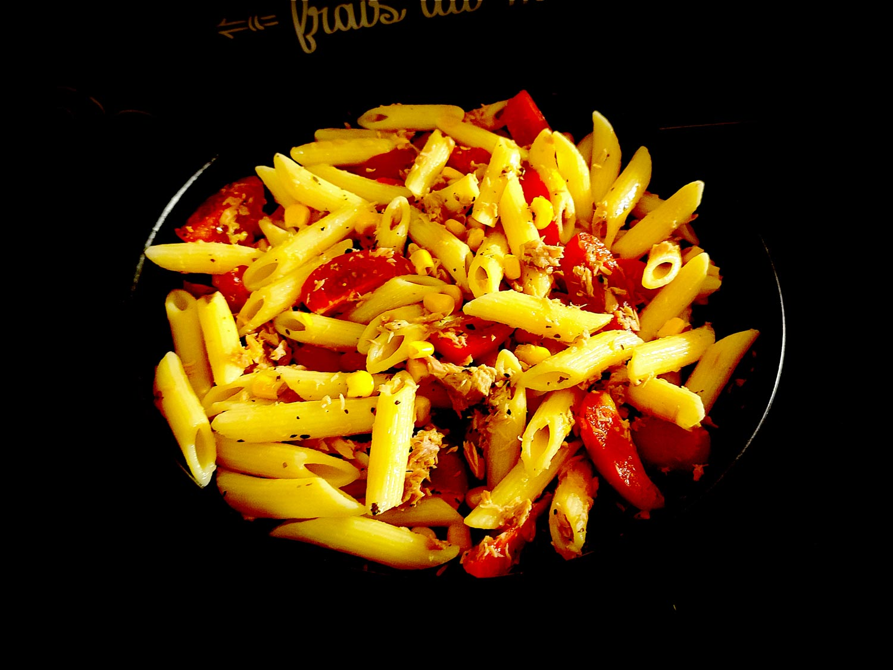

---

layout: recipe
title: "Salade de pâtes au thon, tomate cerise et maïs"
image: pasta-thon/pasta-thon-1.jpg
tags: salade, entrée, plat, accompagnement, thon, pâtes, semoule, farine complète, maïs, tomate cerise, basilic, huile d’olive

ingredients:
- 100g de pâtes courtes à la semoule de blé ou farine complète
- 75g de tomates cerises
- 1 petite boîte de thon nature
- 1 petite boîte de maïs doux
- 1 cuillère à café d’huile d'olive
- basilic
- sel
- poivre 

directions:
- Faites cuire vos pâtes selon les instructions sur le paquet. Rincez-les ensuite à l’eau froide pour accélérer leur refroidissement.
- Pendant ce temps, découpez les tomates cerises en quartier, égouttez le maïs et le thon.
- Une fois les pâtes froides, mélangez les ingrédients dans un bol/boîte hermétique.
- Ajoutez un filet d’huile d’olive, salez, poivrez, et saupoudrez de basilic. Mélangez une dernière fois.
- Conservez au réfrigérateur jusqu’à dégustation.

---

Une petite salade de pâtes pour accompagner l’été. Bien sûr, on pourra remplacer le thon par de la mozzarella, de la fêta, du poulet, etc. Tout est possible avec ce type de recette simple et rapide qui tient plus de l’assemblage que de la cuisine.

Le top c’est qu’on peut également la préparer en avance et la conserver dans des boîtes hermétiques au frais. Et ça mine de rien, ça sauve bien la mise quand on a la grosse flemme de se faire à manger. Les quantités peuvent d’ailleurs être multipliés aisèment pour ça.

 

Conservation&nbsp;: 2–3 jours dans une boîte hermétique au réfrigérateur.