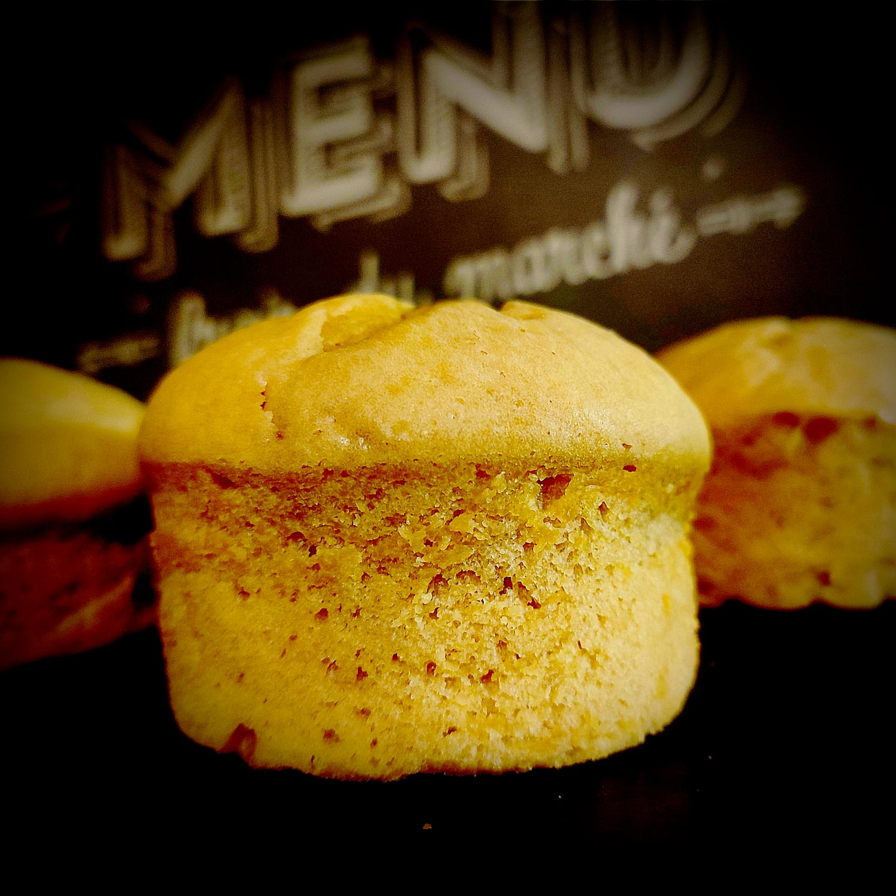

---

layout: recipe
title: "Plumcake allo Yogurt"
image: plumcake/plumcake-1.jpg
tags: snack, moelleux, cake, yaourt grec, sans beurre

ingredients:
- 115g de farine italienne 00/française T45
- 35g de fécule de maïs/Maïzena
- 150g de yaourt grec
- 2 œufs
- 60g de sucre blanc
- 8cl d’huile neutre
- extrait de vanille
- 1 cuillère à café de levure 
- pincée de sel 

directions:
- Préchauffez le four à 160°C.
- Blanchissez les oeufs avec le sucre. 
- Versez l’extrait de vanille et mélangez.
- Ajoutez l'huile petit à petit en continuant à battre. 
- Ajoutez 2 cuillères à soupe des ingrédients secs tamisés et mélangés (farine, levure, sel) en continuant à battre. 
- Ajoutez le yaourt cuillère à soupe par cuillère à soupe en continuant à battre. 
- Ajoutez le restant des ingrédients secs en continuant à battre. 
- Battez le tout jusqu'à obtenir un résultat parfaitement lisse.
- Versez votre pâte dans votre moule à mini cakes.
- Enfournez pour 35–45 minutes. 
- Quand le four commence à embaumer la cuisine d’une bonne odeur de cake et que les plumcakes ont bien gonflé, tenez-vous prêt à tester la cuisson avec un cure-dent/pointe d’un couteau dans les 5 minutes qui suivent. Le bout doit en ressortir propre.
- Laissez refroidir quelques minutes avant de démouler puis déposez-les sur une grille. Ils devraient dégonfler un peu une fois sortis du four.

---

Le <i lang="en">plumcake</i> italien est un mystère quasiment inexplicable – et certains ont essayé en vain d’en découvrir les origines. C’est un cake certes, mais pas du tout un cake aux fruits confits comme on pourrait se l’imaginer.

Non, c’est plutôt une sorte de quatre-quarts allégé – sans beurre et donc à l’huile –, et qui se déguste au petit déjeuner accompagné de confiture ou pâte à tartiner, ou au goûter. 

Ici, c’est une version au yaourt grec, pour amener cette petite pointe d’acidité qui vient trancher avec la douceur de ce plumcake tout léger.

Conservation&nbsp;: 3–5 jours dans une boîte hermétique à l'abri de la chaleur et de la lumière, 2–3 mois au congélateur.