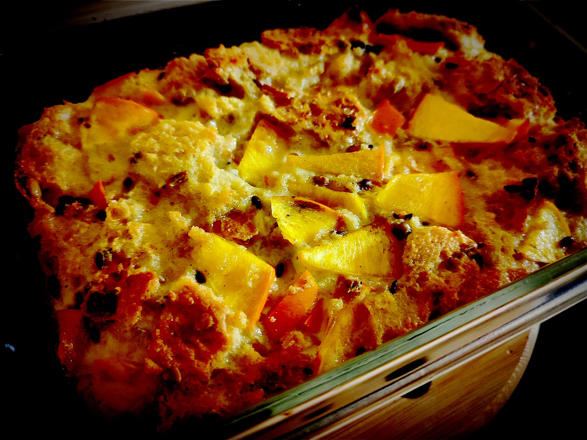

---

layout: recipe
title: "Pudding au kaki"
image: pudding-kaki/pudding-kaki-1.jpg
tags: pudding, pain, récup, sauvetage, rassis, miel, kaki, œufs

ingredients:
- 125g de pain rassis
- 2 œufs
- 25cl de lait
- 3 cuillères à soupe de miel
- 1 kaki

directions:
- Lavez et coupez le kaki en petits dés.
- Dans un plat à gratin, battez les œufs avec le lait et le miel.
- Ajoutez le pain rassis coupé en petits morceaux.
- Ajoutez les dés de kaki.
- Laissez mariner le mélange au moins 15 minutes. L’idée est de bien ramollir le pain avant cuisson.
- Préchauffez le four à 180°C.
- Enfournez pour 30–55 minutes où jusqu’à ce que l’appareil soit pris – ça va dépendre de votre plat mais également du degré de maturité de votre kaki.

---

Une recette pour sauver du pain rassis, parce qu’il n’y a pas que le <i alt="en">french toast</i>/pain perdu dans la vie. Ici on associe notre pain au kaki, fruit d’hiver, en pudding. Dégusté tiède, c’est hyper réconfortant avec la touche de miel qui se sent bien à la dégustation.

Conservation&nbsp;: 2–3 jours au réfrigérateur.