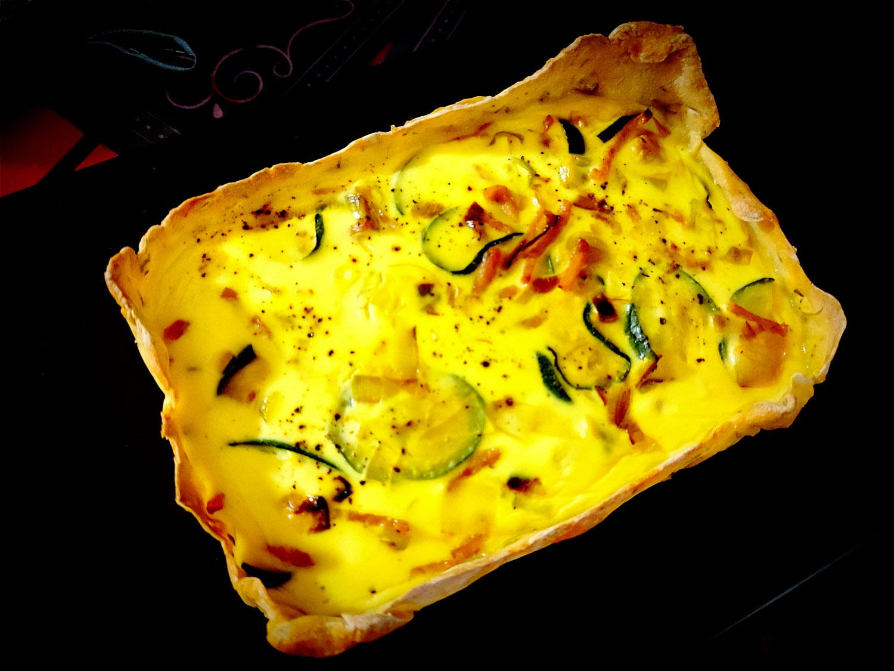

---

layout: recipe
title: "Quiche aux courgettes"
image: quiche-courgette/quiche-courgette-1.jpg
tags: quiche, salé, pâte brisée, poulet, courgette, oignon

components:
- Pâte brisée au fromage blanc

ingredients:
- 1 pâte brisée
- 2 courgettes
- 150g d’allumettes de poulet
- 1 oignon
- 2 œufs
- 20cl de lait
- 20cl de crème liquide entière
- sel
- poivre
- huile

directions:
- Épluchez et émincez l’oignon. Faites-le transpirer dans une poêle avec un peu d’huile.
- Découpez les courgettes en fines tranches et ajoutez-les dans la poêle pour les assécher au maximum avant le passage au four.
- Préchauffez le four à 180°C – ou à la température indiquée sur le paquet de pâte brisée.
- Déroulez et foncez la pâte brisée dans un moule à tarte.
- Battez les œufs avec la crème, le lait, le sel et le poivre.
- Déposez les allumettes de poulet, oignon et tranches de courgettes dans le fond de la pâte.
- Versez l’appareil par dessus. 
- Enfournez 35–45 minutes où jusqu’à ce que l’appareil soit bien pris.

---

Une quiche pour changer du gratin de courgettes. 

 

Conservation&nbsp;: 2–3 jours au réfrigérateur.