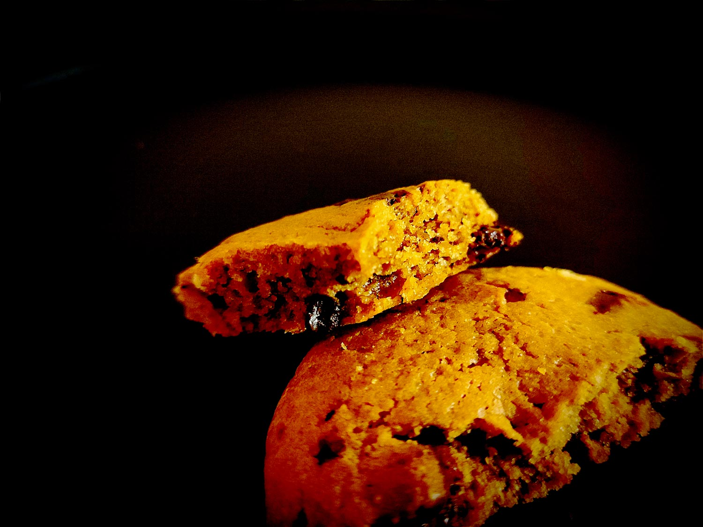

---

layout: recipe
title: "Reese’s Chunkies"
image: reeses-chunkies/reeses-chunkies-1.jpg
tags: cookie, beurre de cacahuète, chocolat, snack, croquant, beurre noisette, caramel

ingredients:
- 125g de farine
- 50g de cassonade
- 25g de sucre blanc
- 75g de beurre noisette (soit environ 90g de beurre)
- 1 œuf
- ½ cuillère à café de levure chimique
- ¼ cuillère à café de bicarbonate alimentaire
- 50g de chocolat noir concassé
- 50g de pépites de beurre de cacahuète Reese’s
- Extrait de vanille
- ½ cuillère à café de lait ou boisson végétale amande
- Pincée de sel de Guérande

components:
- Beurre noisette

directions:
- Versez le beurre noisette dans un saladier avec les deux sucres et fouettez vigoureusement pour obtenir une belle crème.
- Incorporez l’oeuf et la vanille.
- Ajoutez la farine, bicarbonate et levure tamisées, les morceaux de chocolat, les pépites Reese’s, et le sel de Guérande, et incorporez-les à la maryse sans trop travailler la pâte.
- Couvrez le bol avec du film alimentaire et réfrigérez la pâte au moins 1 h au frigo.
- Préchauffez votre four à 180°C.
- Réalisez des boules de cookies à l’aide d’une cuillère à glace, en les espaçant bien les unes des autres sur la plaque de cuisson – ils vont doubler de taille –, puis écrasez-lez légèrement avec la paume de la main.
- Enfournez pendant 12–15 minutes ou jusqu'à ce que leurs bords soient légèrement dorés. 
- Laissez les cookies continuer à cuire sur la plaque de cuisson encore 10 minutes avant de les transférer sur une grille.

---

Le <i lang="en">Reese’s Chunkie</i> est un cookie au beurre noisette avec un ingrédient assez rare mais trouvable dans nos contrées&nbsp;: les pépites de beurre de cacahuète Reese’s, ultra fondantes en bouche et qui amènent un contraste aux morceaux de chocolat – ça fonctionne un peu comme les <i lang="en">cups</i> de la marque.

Pour ré-équilibrer la mâche et ramener du croquant, on utilise du coup de la cassonade plutôt que du sucre complet, plus humide et qui résulterait dans un cookie plus moelleux.

À noter que si vous ne trouvez pas de <i lang="en">Peanut Butter Chips</i> Reese’s, vous pouvez aussi les remplacer par des morceaux de fudge caramel, ça fonctionne de la même façon.

 

Conservation&nbsp;: 3–5 jours dans une boîte non hermétique à l'abri de la chaleur et la lumière, en utilisant du papier cuisson ou de l'essuie-tout pour les séparer en étages si besoin. 2–3 mois au congélateur.