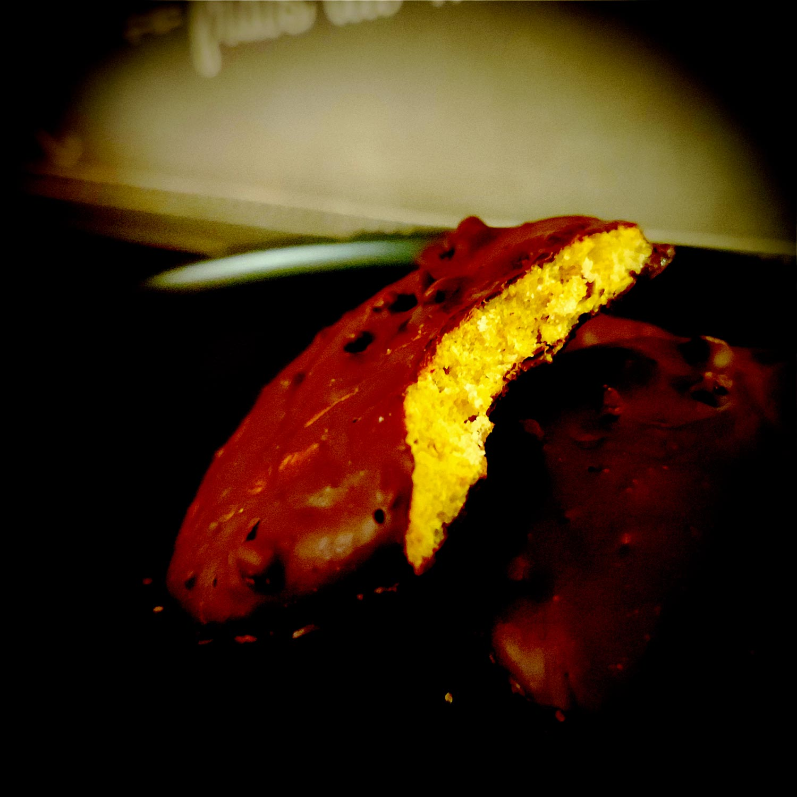

---

layout: recipe
title: "Sablés à l’orange et au chocolat"
image: sable-orange/sable-orange-1.jpg
tags: snack, biscuit, sablé, chocolat, orange, nappage

ingredients:
- 160g de farine semi-complète T110
- 80g de beurre doux mou
- 80g de sucre
- 1 œuf
- extrait de fleur d’oranger 
- pincée de sel
- 150g de chocolat noir aux écorces d’orange

directions:
- Crémez le beurre mou avec le sucre et la pincée de sel pour obtenir une consistance bien lisse. 
- Ajoutez l’œuf et la fleur d’oranger et continuez à battre pour les incorporer totalement – le mélange ne devrait plus être collant à ce stade. 
- Ajoutez enfin la farine jusqu'à ce qu'il n'y ait plus de grumeau. 
- Filmez le bol et laissez reposer au minimum 30 minutes au réfrigérateur.
- Préchauffez le four à 180°C.
- Sur une plaque de cuisson recouverte d’un tapis ou de papier, déposez des des boules de pâte comme vous le feriez avec des cookies, en laissant de l’espace entre chaque puisqu’elles vont s’étaler à la cuisson.  
- Enfournez-les pour 12–15 min ou jusque ce que les bords soient légèrement dorés. 
- Laissez-les ensuite refroidir sur une grille. 
- Une fois les biscuits revenus à température ambiante, faites fondre votre chocolat au bain-marie/micro-ondes dans un récipient suffisamment large et profond pour y tremper vos biscuits. 
- Immergez-les dans le chocolat et, à l'aide d'une fourchette, assurez-vous de bien les enrober de chocolat en laissant couler l'excédent. Si votre chocolat vous semble trop épais, vous pouvez y ajouter un peu d’huile.
- Laissez ensuite le chocolat prendre en déposant vos biscuits enrobés sur du papier cuisson. Pour accélérer le processus vous pouvez également les faire passer au réfrigérateur.

---

Un sablé enrobé de chocolat avec une double dose d’orange&nbsp;: la fleur d’oranger dans la pâte, les écorces séchées dans le nappage chocolat. Pour ceux qui aiment le mariage entre le chocolat et l’orange, on ne va pas faire les choses à moitié. Si tu connais le <i lang="en">snack shortcake</i> anglais de Cadbury, ça ressemble un peu beaucoup à ça.

La spécificité de cette recette, c'est qu’on obtient un sablé bien croquant avec une pâte qui se manipule comme celle des cookies&nbsp;! Ça fait un peu bizarre au début mais le résultat est canon.

Conservation&nbsp;; 5–7 jours dans une boîte à biscuits à l'abri de la chaleur et de la lumière. Vous pouvez également les congeler pour 2–3 mois. 