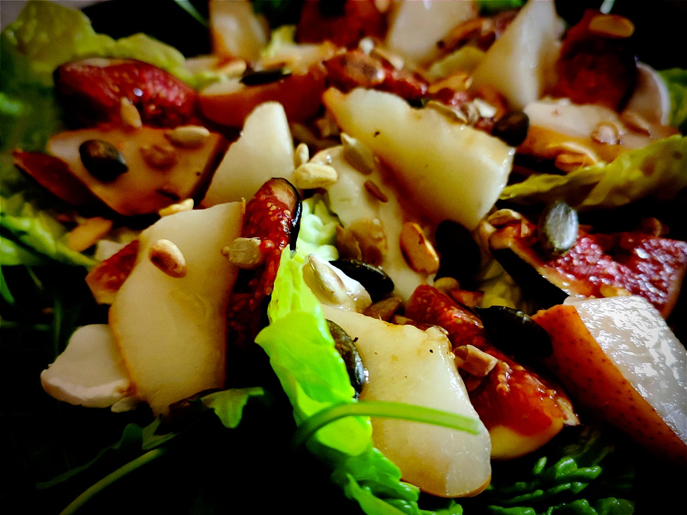

---

layout: recipe
title: "Salade au chèvre, figues, poires et miel"
image: salade-figue-poire/salade-figue-poire-1.jpg
tags: salade, entrée, sucré-salé, figue, poire, miel, chèvre, fromage frais, roquette, vinaigrette, sucrine, graines

ingredients:
- 100g de roquette
- quelques feuilles de sucrine
- 75g de bûche de chèvre
- 4 figues
- 2 poires
- 1 poignée de mélange de graines
- 3 cuillères à soupe d’huile d’olive
- 1 cuillère à soupe de vinaigre balsamique
- 1 cuillère à café de miel
- sel
- poivre

directions:
- Dans une poêle bien chaude, faites torréifier les graines quelques minutes. Réservez.
- Découpez les fruits en quartiers et faites-les cuire à cœur à feu moyen doux.
- Préparez la vinaigrette. Mélangez l’huile, le vinaigre, le miel, le sel et le poivre.
- Découpez la bûche de chèvre en tranches.
- Dressez une grande poignée de roquette dans votre assiette, puis ajoutez quelques feuilles de sucrine. Déposez des tranches de fromage de chèvre puis ajoutez les figues et poires.
- Versez de la vinaigrette par dessus puis saupoudrez d’une belle quantité de graines torréifiées.

---

Une salade sucrée-salée hyper réconfortante et pas trop compliquée à préparer. La petite astuce, c’est que les feuilles de sucrine peuvent servir de barquette pour composer des bouchées, comme des tortillas ou du pain plat.

 

Conservation&nbsp;: 2–3 jours au réfrigérateur.