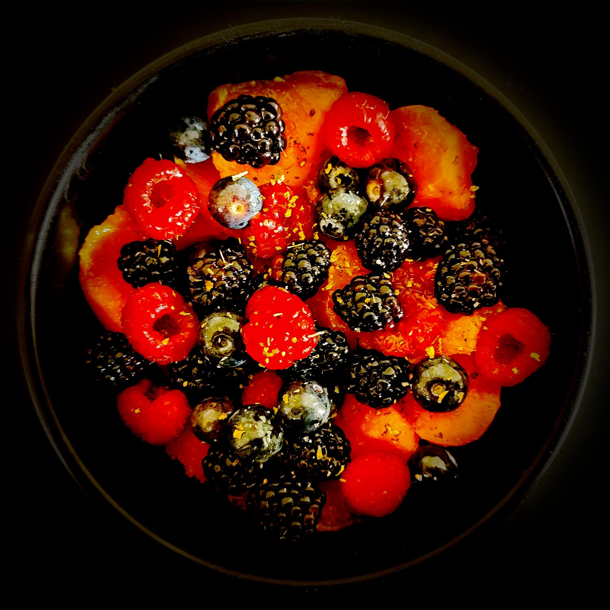

---

layout: recipe
title: "Salade de fruits d’été"
image: salade-fruits-ete/salade-fruits-ete-1.jpg
tags: salade, dessert, sucré, melon, fruits rouges, myrtilles, mûres, framboises, citron

ingredients:
- 1 melon
- 1 barquette de mûres 
- ½ barquette de framboises
- ½ barquette de myrtilles
- 1 cuillère à soupe de jus de citron
- miel (facultatif)
- menthe ou basilic (facultatif)

directions:
- Ouvrez le melon en 2, enlevez les graines puis prélevez des billes ou coupez-le en quartiers afin de pouvoir tailler des petits dés. 
- Dans un saladier, ajoutez les framboises, les mûres, les myrtilles, et citronner. 
- Saupoudrez de menthe ou de basilic. 
- Si le résultat est trop acidulé à votre goût vous pouvez ajouter un peu de miel et mélanger délicatement avant dégustation. 

---

Une salade de fruits d’été sucrée-acidulée à base de melon et fruits rouges. Simple, basique, rafraichissant.

 

Conservation&nbsp;: 2 jours dans une boîte hermétique au réfrigérateur.