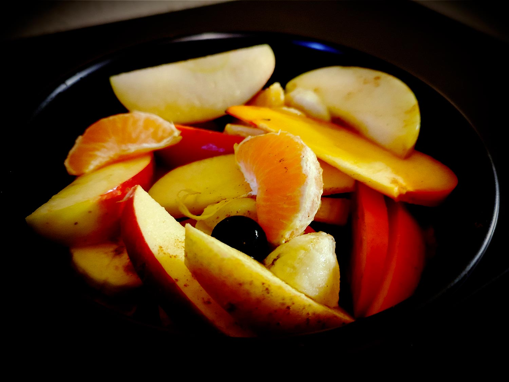

---

layout: recipe
title: "Salade de fruits magique"
image: salade-magique/salade-magique-1.jpg
tags: salade, dessert, sucré, melon, fruits rouges, myrtilles, mûres, framboises, citron

ingredients:
- 1 mandarine/orange/clémentine
- 1 kiwi
- 1 banane
- 1 pomme
- baies/fruits rouges
- 1 cuillère à café de sucre vanillé ou de 1/2 de cannelle

directions:
- Lavez, épluchez (si la peau ne se mange pas), et découpez tous les fruits en tranches, en quartiers ou en dés.
- Mélanger grossièrement à la cuillère dans un tupperware. 
- Ajoutez le sucre vanillé ou la cannelle. 
- Agitez 30–60 secondes, comme pour une poudre à boire au shaker. 
- Réservez au frais au moins 2 heures.

---

Une salade magique qui se fait quasiment toute seule en la secouant dans un tupperware. Par contre attention si vous décidez de prendre des fruits plus fragiles, il vaudra mieux les intégrer et mélanger après avoir secoué.

L”important c'est d’avoir quelques fruits qui rendent du jus et 1 bonne association de goûts/saison. 

 

Conservation&nbsp;: 2 jours dans une boîte hermétique au réfrigérateur.