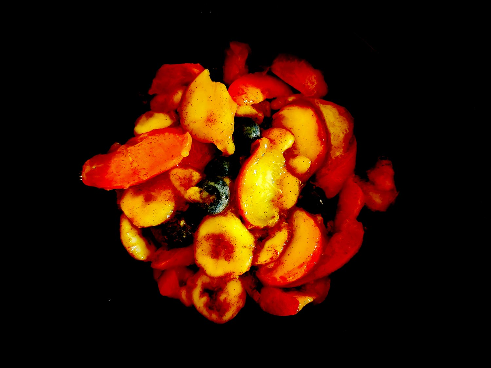

---

layout: recipe
title: "Salade magique pêche abricot"
image: salade-peche-abricot/salade-peche-abricot-1.jpg
tags: salade, dessert, sucré, pêche, abricot, myrtilles, banane, cannelle

ingredients:
- 1 pêche
- 2 abricots
- 1 banane
- 1 poignée de myrtilles
- 1/2 cuillère à café de cannelle
- 1 trait de jus de citron

directions:
- Lavez, épluchez (si la peau ne se mange pas), et découpez tous les fruits en tranches, en quartiers ou en dés.
- Mélanger grossièrement à la cuillère dans un tupperware. 
- Saupoudrez de cannelle puis ajoutez un trait de jus de citron. 
- Agitez 30–60 secondes, comme pour une poudre à boire au shaker. 
- Réservez au frais au moins 2 heures.

---

Une autre salade magique qui se fait quasiment toute seule en la secouant dans un tupperware. Ce coup-ci on prend le couple pêche abricot et on le saupoudre d’une belle cuillérée de cannelle.

 

Conservation&nbsp;: 2 jours dans une boîte hermétique au réfrigérateur.