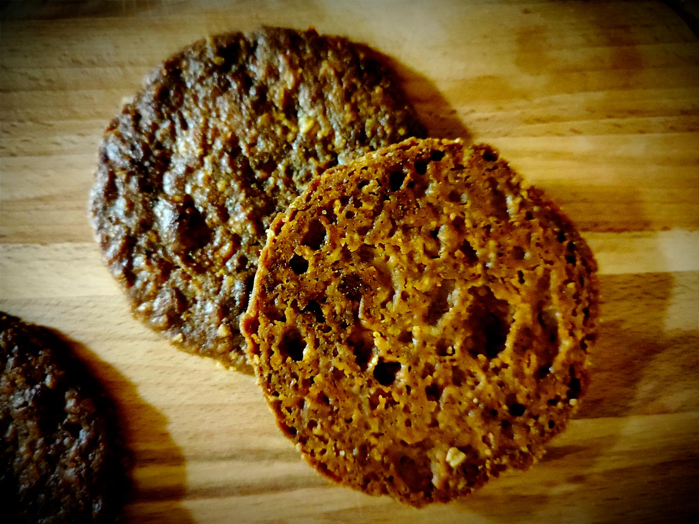

---

layout: recipe
title: "Speculoos"
image: speculoos/speculoos-1.jpg
tags: snack, biscuit, speculoos, 4 épices, cannelle, muscade, croquant

ingredients:
- 150g de farine
- 30g de son d’avoine
- 125g de sucre vergeoise brune
- 125g de beurre doux très mou
- 2g de cannelle
- 2g de mélange 4 épices
- 1g de noix de muscade
- 1 cuillère à soupe de lait
- pincée de sel

directions:
- Mélangez le sucre, la cannelle, le mélange 4 épices, et la noix de muscade.
- Ajoutez le beurre mou et crémez le tout pour obtenir une consistance bien lisse.  
- Ajoutez la farine et le sel mélangés et tamisées et incorporez-les à la maryse jusqu'à ce qu'il n'y ait plus de grumeau. Ne mélangez pas plus.
- Ajoutez le lait, mélangez et formez une boule.
- Filmez-la et laissez reposer au moins 2h au frigo – l’idéal est de le faire la veille pour le lendemain.
- Préchauffez le four à 190–200°C.
- Abaissez la pâte sur une épaisseur de 3–4mm puis découpez des biscuits à l’aide d’un emporte-pièce.
- Disposez-les sur une plaque de cuisson recouverte d’un tapis ou de papier.
- Enfournez-les pour 12–15 min ou jusque ce que les bords soient légèrement dorés. 
- Laissez-les ensuite refroidir sur une grille. 

---

Le biscuit iconique à la cannelle, référence bien connue des rayons de la grande alimentation, spécialité d’artisans du Nord et de Belgique, ingrédient bien utile pour réaliser un fond de <i lang="en">cheesecake</i> ou un crumble en 2–2 avant de servir ses verrines.

Chacun à sa recette, son propre mélange d’épices, ses ingrédients secrets (e.g. la vergeoise brune) et pourtant… c'est peut-être ce qu’on y met pas qui est le plus important. En l’ocurrence ici, ni œuf ni levure, pour obtenir un résultat craquant et friable.

Conservation&nbsp;; 5–7 jours dans une boîte à biscuits à l'abri de la chaleur et de la lumière. Vous pouvez également les congeler pour 2–3 mois. 