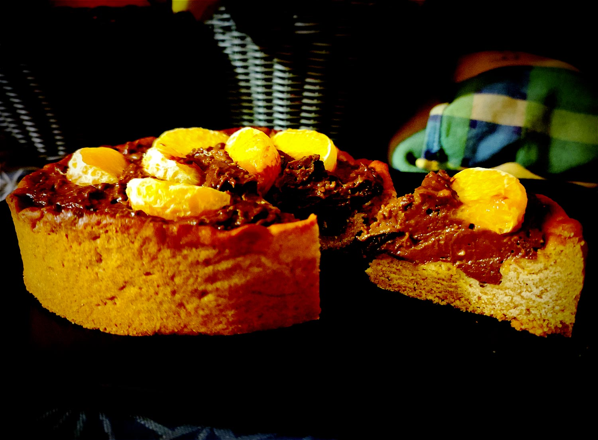

---

layout: recipe
title: "Tarte au chocolat et clémentine"
image: tarte-clementine/tarte-clementine-1.jpg
tags: tarte, chocolat, fruit, clémentine, crème pâtissière, huile d’olive

ingredients:
- 1 pâte sucrée
- quartiers d’une clémentine ou mandarine
- 1 blanc d’œuf
- 25g de chocolat noir aux écorces d’orange pour la crème pâtissière au chocolat
- extrait de fleur d’oranger (facultatif)

components:
- Pâte sucrée
- Crème pâtissière

directions:
- Foncez la pâte dans un moule beurré et réservez au réfrigérateur.
- Préparez votre crème pâtissière au chocolat. Pour encore plus de profondeur, vous pouvez y ajouter de l’extrait de fleur d’oranger.
- Préchauffez le four à 180°C.
- Sortez votre moule du réfrigérateur, ajoutez du papier cuisson sur la pâte puis déposez des cailloux ou des billes de cuisson.
- Faites-la cuire à blanc pendant 10 minutes.
- Ressortez-la du four, enlevez les billes et le papier, et nappez le fond de blanc d’œuf.
- Réenfournez pour 5 minutes. L’idée est de créer une sorte de barrière afin que la crème ne vienne pas rendre le fond de tarte trop humide.
- Versez votre crème pâtissière dans le fond de tarte et égalisez.
- Déposez les quartiers de clémentine sur la crème.
- Dégustez tiède ou froid en conservant la tarte au frigo.

---

Une crème pâtissière ultra gourmande au chocolat et notes d’orange (écorces, extrait de fleur d’oranger), et une pâte sucrée toute simple pour la mettre bien en évidence.

Pour ajouter une note acidulée, on utilise des quartiers de clémentine entiers mais vous pouvez tout aussi bien faire l’impasse et déguster tel quel.

Conservation&nbsp;: 2 jours au réfrigérateur.