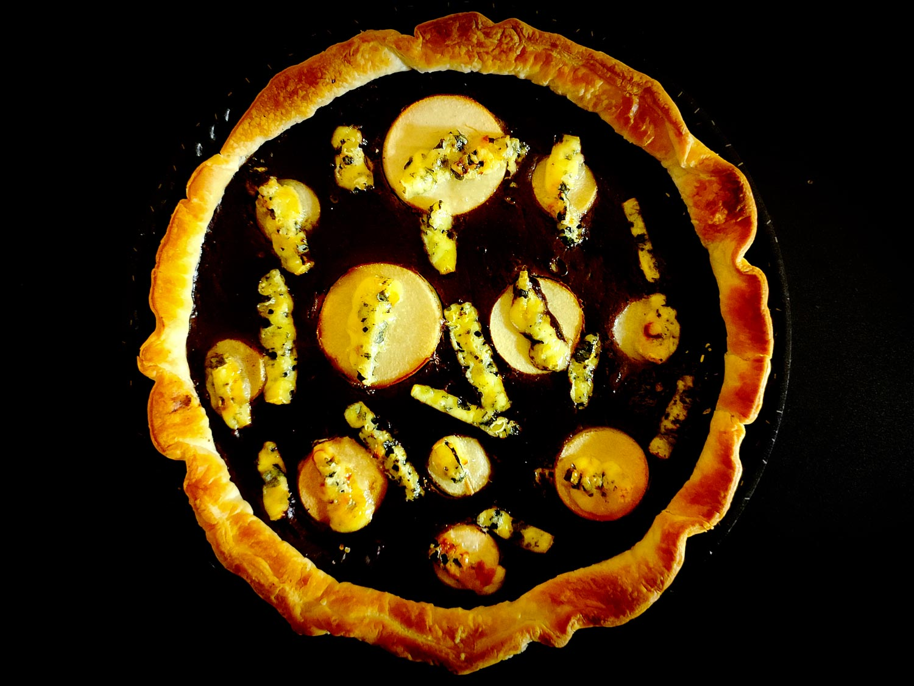

---

layout: recipe
title: "Tarte aux poires et au boudin"
image: tarte-boudin/tarte-boudin-1.jpg
tags: tarte, poire, boudin noir, bleu d’auvergne, fromage, tofu, sucré salé

ingredients:
- 1 pâte feuilletée
- 2 poires (environ 300g)
- 100g de bleu d'Auvergne ou de roquefort ou de fourme d’Ambert
- 2 œufs
- 1 boudin noir (environ 125g)
- 1 oignon
- 200g de tofu soyeux
- 1 cuillère à café de fond de veau
- 10cl d’eau
- huile
- sel
- poivre
- noix de muscade
- cannelle

directions:
- Égouttez le tofu soyeux.
- Faites revenir l’oignon dans huile, puis ajoutez l’eau et le fond de veau. Laissez cuire 2 minutes. 
- Battez le tofu soyeux égoutté en crème. 
- Entaillez et enlevez la peau du boudin noir puis ajoutez-le à la poêle. Mélangez.
- Ajouter le tofu soyeux puis le poivre et mélangez. 
- Agitez la poêle jusqu’à l’apparition des premières bulles puis retirez du feu et réservez.
- Préchauffez le four à 180°C (ou plus, cf. les instructions de votre pâte feuilletée).
- Foncez votre pâte dans le moule à tarte.
- Lavez puis épluchez les poires puis découpez-les en tranches. Découpez quelques ronds à l’aide d’un emporte-pièce pour la décoration et mettez-les de côté. Découpez le reste de poires en petits dés et disposez-les sur le fond de tarte.
- Coupez le fromage bleu en fines allumettes et réservez-en quelques unes pour la décoration. Disposez le reste avec les poires sur le fond de tarte.
- Ajoutez les œufs dans votre crème de boudin et fouettez pour obtenir un appareil bien lisse.
- Versez-le sur les poires et le boudin.
- Décorez avec vos ronds de poires et allumettes de bleu réservées.
- Enfournez pour 30–40 minutes où jusqu’à ce que la pâte feuilletée soit bien développée et que l’appareil crémeux soit pris.
- Dégustez chaud ou tiède.

---

Une tarte en trompe l’œil qui joue sur le contraste sucré salé. De loin, on pourrait croire à une tarte aux poires et chocolat, mais c’est bel et bien du boudin noir qui vient accompagner la poire ici. Il n’y a pas que la pomme à qui la poire réussit&nbsp;!

Pour encore plus de gourmandise, on ajoute des allumettes de bleu d’Auvergne, bien que vous pouvez utiliser un autre fromage à pâte persillée – voire tenter autre chose. Pour parfaire l’illusion de la tarte au chocolat, vous pourriez même plutôt en faire des copeaux. À vous de jouer.

Conservation&nbsp;: 2–3 jours au réfrigérateur.