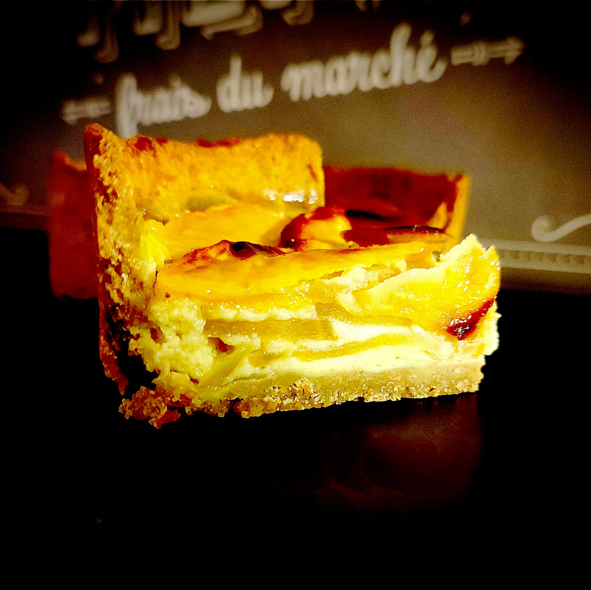

---

layout: recipe
title: "Tarte aux pommes"
image: tarte-pomme/tarte-pomme-1.jpg
tags: tarte, pomme, fruit, Dinosaurus, seigle, crème fraîche

ingredients:
- 2 à 3 pommes
- 200g de crème fraîche épaisse
- 1 œuf
- 1 cuillère à soupe de farine
- ½ cuillère à soupe de cassonade
- Extrait de vanille

components:
- Pâte sablée Dinosaure

directions:
- Préchauffez le four à 180°C.
- Abaissez la pâte puis foncez-la dans un moule à tarte. 
- Pas besoin de la piquer. Contrairement à la croyance populaire, c'est en la piquant qu'on risque de la rendre humide avec l'appareil, surtout la crème prise à la cuisson, et pas l'inverse – et c'est Thierry Marx qui l'a découvert avec l'aide du physico-chimiste Raphaël Haumont. Après si vous tenez absolument à piquer, vous pouvez appliquer du blanc d'oeuf et passer 3 minutes au four pour créer une couche d'imperméabilisation.
- Mélangez la crème avec l’œuf, la farine et la vanille. Réservez.
- Coupez les pommes en tranches fines, mettez-les sur le fond de tarte et versez la préparation par dessus. 
- Enfournez pendant environ 20 min ou jusqu'à ce que l'appareil soit tout juste pris.
- Sortez la tarte du four et saupoudrez de cassonade. 
- Ré-enfournez pour 5 minutes ou jusqu'à ce que le sucre ait bien caramélisé. 
- Laissez refroidir avant de démouler. La tarte se mange tiède ou froide. 

---

Une tarte classique qui utilise une pâte sablée au seigle pour complimenter la pomme. 

Pour le choix des pommes, il vous faut une variété qui reste ferme après cuisson et suffisamment sucré pour venir balancer l'acidité de la crème fraîche. Nous éviterons donc la Granny Smith trop acide pour cette recette, et privilégierons la Golden, la Fuji, la Gala ou le grand classique, la Royal Gala. 

Conservation&nbsp;: 2–3 jours au réfrigérateur.