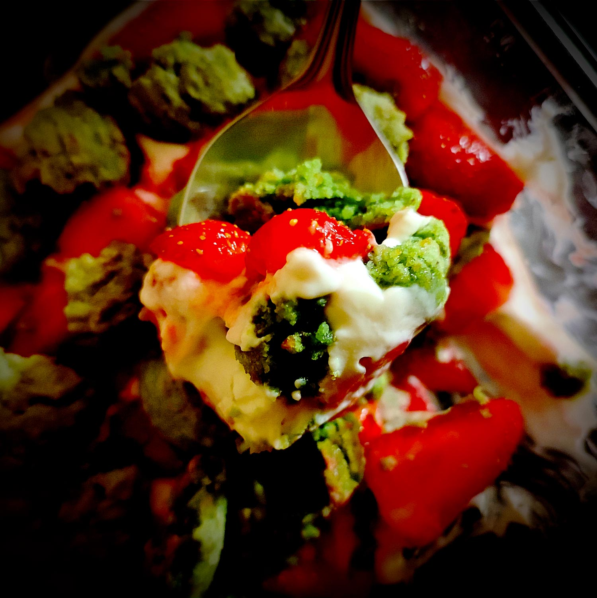

---

layout: recipe
title:  "Tiramisu aux fraises et à la ricotta"
image: tiramisu-ricotta/tiramisu-ricotta-1.jpg
tags: dessert, froid, sans cuisson, fraises, ricotta, amaretti morbidi, crémeux

ingredients:
- 250g de ricotta
- 250g de fraises
- 150g d’amaretti morbidi pistache
- 25–30g de sucre glace ou de miel
- 2 cuillère à soupe de jus de citron
- 1 sachet de sucre vanillé

directions:
- Lavez, essuyez puis équeutez les fraises. 
- Découpez-les en quartiers ou moitiés (selon leur taille) puis déversez-les dans un bol. 
- Ajoutez une cuillère à soupe de jus de citron, puis le sachet de sucre vanillé, et mélangez bien avec une cuillère pour napper l'ensemble des morceaux. Réservez.
- Dans un autre bol, fouettez la ricotta pour la rendre plus crémeuse, ajoutez le sucre glace/miel et battez pour obtenir une crème bien lisse, sans grumeau. 
- Ajoutez une cuillère à soupe de jus de citron et mélangez bien. 
- Dans un récipient pouvant aller au réfrigérateur, tapissez le dessous de la moitié de crème ricotta, puis faites une deuxième couche avec la moitié de fraises, et enfin la moitié d'amaretti que vous aurez grossièrement émiettés (l'idée est d'avoir des gros morceaux, donc de découper chaque amaretti en 3 ou en 4).
- Répétez l'opération avec l'autre moitié de chaque ingrédient. 
- Vous pouvez déguster de suite ou réserver au frigo en filmant/refermant le récipient. 

---

Il n’y a pas que le mascarpone pour venir confectionner un tiramisu, il y a la ricotta aussi. Tiramisu signifie “Remonte-moi le moral”, c’est donc le dessert parfait à préparer quand ça va couci-couça. 

Dans cette version aux <i lang="en">amaretti morbidi</i>, qui sont donc la variante molle du biscuit italien, il peut même être préparé à la dernière minute, sans passage au réfrigérateur, puisqu’il n’y a pas besoin de les faire tremper. 

On peut évidemment le conserver au frais si préparé à l’avance mais il faudra veiller à le sortir 30–45 minutes avant dégustation si vous souhaitez retrouver du crémeux – le ricotta va durcir au réfrigérateur, mais vous préférerez peut-être comme ça.

En alternative à la pistache, vous pouvez utiliser des <i lang="en">amaretti</i> à l’amande – et éventuellement de l’extrait d’amande à la place de la cuillère à soupe de jus de citron dans la crème sucrée de ricotta. Notez que la recette fonctionne également avec des framboises.

Conservation&nbsp;: 48 heures au frigo.