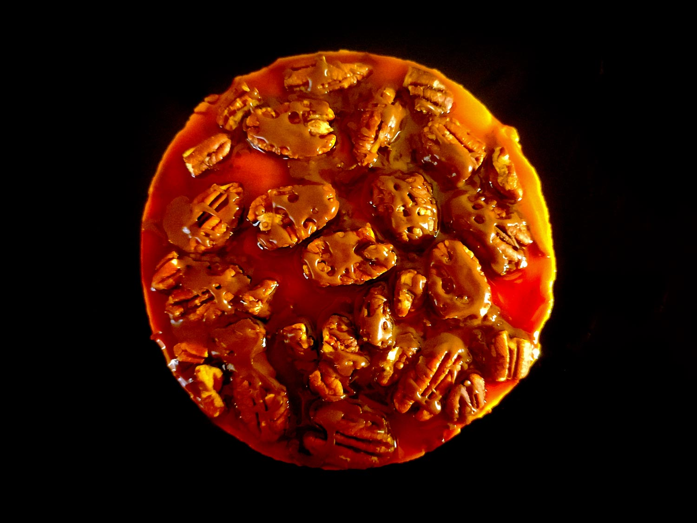

---

layout: recipe
title: "Cheesecake Turtle"
image: turtle-cheesecake/turtle-cheesecake-1.jpg
tags: cheesecake, sans cuisson, crust, ricotta, mascarpone, sucre glace, sans four

components:
- Cocoa Crust
- Caramel au beurre salé
- Glaçage cacao

ingredients:
- 1 crust au cacao
- 250g de mascarpone
- 250g de ricotta
- 125g de sucre glace
- 30g de caramel pour l’appareil
- 45g de caramel pour le nappage
- 40–50g de noix de pécan
- 15–20g de glaçage cacao
- du gélifiant (facultatif)

directions:
- Tapissez un moule à charnière avec votre crust/pâte sablée, en prenant bien soin de la presser et tasser pour que celle-ci soit compacte et solide après refroidissement.
- Réservez au moins 30 minutes au réfrigérateur pour faire durcir cette base.
- Pendant que votre pâte est au frais, mélangez la ricotta, le mascarpone, et le caramel. Le but est d’obtenir un appareil légèrement ambré. 
- Ajoutez le sucre glace et battez vigoureusement jusqu’à l’obtention d’un appareil bien lisse et aérien.
- Si votre cheesecake ne sera pas consommé en une seule fois, il peut être utile d’ajouter un gélifiant pour assurer sa tenue une fois démoulé, surtout qu’on va ajouter du poids par dessus.
- Retirez votre pâte du réfrigérateur et étalez votre mélange ricotta-mascarpone sur la pâte.
- Remettez le tout au frais pour au moins 2h ou, encore mieux, toute une nuit.
- Avant de servir, préparez votre glaçage cacao.
- Démoulez votre cheesecake puis versez le nappage caramel – vous pouvez aussi le faire pour des parts individuelles. 
- Puis ajoutez les noix de pécan et, enfin, faites couler le glaçage cacao en filet par dessus.
- Vous pouvez remettre 10 minutes au frigo pour que le glaçage prenne et se solidifie, ou déguster de suite.

---

Une autre recette de cheesecake, mais avec un mélange “Turtle”, c’est à dire un trio caramel, chocolat, et noix de pécan. Les [Turtles sont une confiserie chicagoane inventée en 1918](https://en.wikipedia.org/wiki/Turtles_(chocolate)) et qui prennent la forme d’une tortue avec une base en noix de pécan, une garniture caramel bien coulant, et un enrobage au chocolat noir ou au lait.

C’est tellement délicieux que ce mélange est décliné de moult façons, et qu’on peut donc trouver des brownies Turtle, des cookies Turtle, des tartes Turtle ou encore, comme ici, des cheesecakes Turtle.

Conservation&nbsp;: 48 heures au frigo. 1 mois au congélateur mais il faut absolument faire prendre le cheesecake au réfrigérateur avant, on ne peut pas le mettre directement au congélateur.