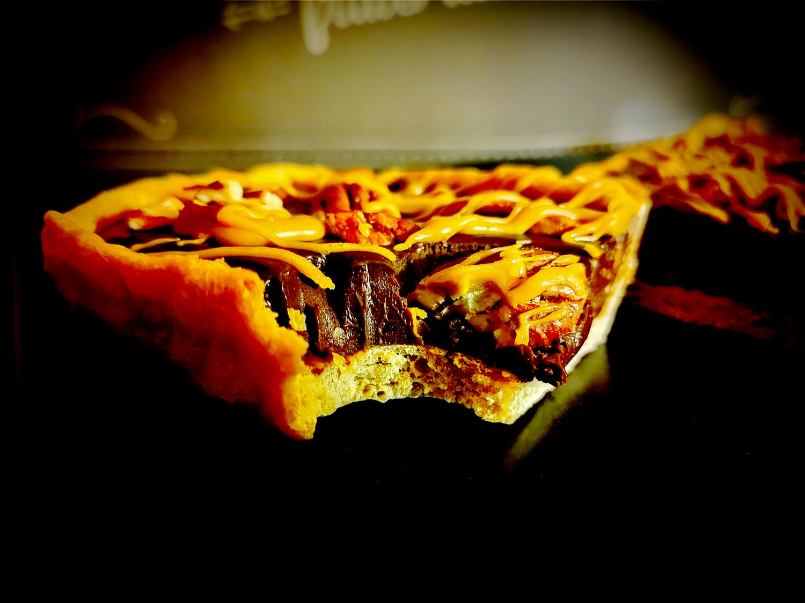

---

layout: recipe
title: "Tarte Turtle"
image: tarte-turtle/tarte-turtle-1.jpg
tags: tarte, épeautre, caramel, caramel, turtle, ganache, chocolat noir, noix de pécan

components:
- Pâte brisée épeautre caramel
- Ganache chocolat noir
- Glaçage caramel à l’ancienne

ingredients:
- 1 pâte brisée épeautre caramel
- 400g de ganache chocolat noir
- 50g de glaçage au caramel
- 50g de noix de pécan
- 1 blanc d’œuf

directions:
- Foncez la pâte dans un moule beurré et réservez au réfrigérateur.
- Préparez votre ganache au chocolat noir.
- Préchauffez le four à 180°C.
- Sortez votre moule du réfrigérateur, ajoutez du papier cuisson sur la pâte puis déposez des cailloux ou des billes de cuisson.
- Faites-la cuire à blanc pendant 10 minutes.
- Ressortez-la du four, enlevez les billes et le papier, et nappez le fond de blanc d’œuf.
- Réenfournez pour 5 minutes. L’idée est de créer une sorte de barrière afin que la crème ne vienne pas rendre le fond de tarte trop humide.
- Versez votre ganache dans le fond de tarte et égalisez.
- Déposez les noix de pécan par dessus.
- Faites prendre la ganache au frigo pour 1 heure.
- Préparez ensuite votre glaçage caramel.
- Versez-le en filet sur le dessus de la tarte. S’il durcit, vous pouvez le remettre sur le feu pour le rendre plus liquide.
- Dégustez tiède ou froid en conservant la tarte au frigo.

---

Une autre recette “Turtle”, mais on inverse les composants par rapport au <a href="turtle-cheesecake.html">cheesecake</a>&nbsp;: le chocolat se retrouve en ganache, le caramel dans la pâte et le glaçage. Vous l’aurez compris, c’est une tarte pour ceux qui préférent le chocolat au caramel – ou l’amertume au sucré –, ou ceux qui adorent le mélange mais souhaitent varier.

Pour encore plus de gourmandise, vous pouvez ajouter des morceaux de noix de pécan dans la ganache voire même dans la pâte. En tout cas cette ganache saura mettre en valeur sa belle couleur ambrée après cuisson à blanc.

Conservation&nbsp;: 2–3 jours au frigo.